# Refarm Architecture

> **"Solo Fértil" — Fertile Soil for Sovereign Data"**

Refarm is a Personal Operating System for centralising and "reforming" data from multiple fragmented sources. It operates **offline-first**, stores everything in **SQLite/OPFS** in the user's browser, and uses **Nostr** as its decentralised plugin marketplace and sync backbone.

---

## Composition Model: Blocks and Distros

Refarm is organized as two explicit layers. Understanding this distinction is essential before
reading the rest of this document.

**Blocks** (`packages/`): Philosophy-neutral primitives. Any developer — regardless of their
architecture preferences — can use these to build centralized, hybrid, or sovereign applications.
A block has no opinion about offline-first, P2P, or sovereignty. It implements one contract.

**Distros** (`apps/`): Opinionated assemblies of blocks. `refarm.me`, `refarm.dev`, and
`refarm.social` are Refarm's own distros. They represent the sovereign, local-first, P2P
philosophy — but they are **examples**, not requirements. You can compose Refarm blocks into
a traditional centralized web app without adopting any of it.

**Dogfood rule**: Every Refarm distro is built entirely from Refarm blocks. This validates
the blocks and demonstrates composability. See [ADR-046](../specs/ADRs/ADR-046-refarm-composition-model.md).

```text
┌─────────────────────────────────────────────────────────┐
│                      DISTROS (apps/)                    │
│  refarm.me  ·  refarm.dev  ·  refarm.social             │
│  opinionated: sovereign, local-first, P2P               │
└──────────────────────┬──────────────────────────────────┘
                       │ assembled from
┌──────────────────────▼──────────────────────────────────┐
│                      BLOCKS (packages/)                 │
│  tractor · storage-rest · storage-sqlite · sync-loro    │
│  identity-nostr · ds · heartwood · …                    │
│  philosophy-neutral — any combination is valid          │
└─────────────────────────────────────────────────────────┘
```

---

## Design Principles

| Principle | Meaning | Foundational ADR |
|---|---|---|
| **Offline-First** | All data lives in the browser (SQLite via OPFS). Network is optional. | [ADR-002](../specs/ADRs/ADR-002-offline-first-architecture.md) |
| **Sovereign Bootloader** | The UI (Homestead) is a pure SSG/SPA "empty shell". It boots the graph. | [ADR-036](../specs/ADRs/ADR-036-sovereign-bootloader-and-strict-ssg.md) |
| **Edge Connectivity** | Cloudflare Workers/Edge deployed *only* as async mailboxes/KV relays. | [ADR-036](../specs/ADRs/ADR-036-sovereign-bootloader-and-strict-ssg.md) |
| **Radical Ejection Right** | Every primitive can be taken out and used in another project. | [ADR-046](../specs/ADRs/ADR-046-refarm-composition-model.md) |
| **Sandboxed Plugins** | Plugins run as WASM components via WIT-defined interfaces. In the browser, WASM is loaded via OPFS-cached ES modules (install-time transpilation). In Node.js, JCO transpiles at plugin load time. | [ADR-017](../specs/ADRs/ADR-017-studio-micro-kernel-and-plugin-boundary.md), [ADR-044](../specs/ADRs/ADR-044-wasm-plugin-loading-browser-strategy.md) |
| **Sovereign Graph** | Data is normalised to JSON-LD (semantic portability). | [ADR-010](../specs/ADRs/ADR-010-schema-evolution.md) |
| **Decentralised Discovery** | Pluggable architecture; designed for P2P protocols (e.g. Nostr) for future plugin marketplaces. | [ADR-011](../specs/ADRs/README.md#planned-future-adrs) *(planned)* |

---

## Evolutionary Roadmap

The Refarm vision is executed in stratified phases, evolving from a local "Fertile Soil" to an "Autonomous Sovereign Agent".

### Phase 1: The Fertile Soil (Stability)
Focus on the **Sovereign Microkernel** (Tractor) and stable storage. Ensuring that plugins can ingest data into the **Sovereign Graph** with strict capability-based security.
→ Core ADRs: [ADR-017](../specs/ADRs/ADR-017-studio-micro-kernel-and-plugin-boundary.md) (plugin boundary), [ADR-036](../specs/ADRs/ADR-036-sovereign-bootloader-and-strict-ssg.md) (bootloader), [ADR-044](../specs/ADRs/ADR-044-wasm-plugin-loading-browser-strategy.md) (WASM loading), [ADR-047](../specs/ADRs/ADR-047-tractor-native-rust-host.md)/[ADR-048](../specs/ADRs/ADR-048-tractor-graduation.md) (tractor-native)

### Phase 2: Hybrid Connectivity (Cognition)
Introduction of **Hybrid Sync** (Matrix/HTTP/P2P) and local AI (via **WebLLM**). The engine becomes capable of structured JSON generation, transforming raw inputs into semantic nodes automatically.
→ Core ADRs: [ADR-045](../specs/ADRs/ADR-045-loro-crdt-adoption.md) (Loro CRDT), [ADR-012](../specs/ADRs/README.md#planned-future-adrs) *(planned: LLM strategy)*

### Phase 3: Sovereign Agent (Autonomy)
Full **P2P Marketplace** (Nostr) and **Agêntic Function-Calling**. The system transitions from a database to an autonomous assistant (like Claude Code) capable of **Runtime Synthesis**—generating interfaces, plugins, and entire distros on the fly based on natural language. See **[Vision 2026](./proposals/VISION_2026_AI_AGENT_SOVEREIGNTY.md)**.
→ Core ADRs: [ADR-011](../specs/ADRs/README.md#planned-future-adrs) *(planned: Plugin Marketplace NIP-89/94)*

---
## Monorepo Map

> Structure formalized in [ADR-001](../specs/ADRs/ADR-001-monorepo-structure.md). Blocks vs Distros composition model in [ADR-046](../specs/ADRs/ADR-046-refarm-composition-model.md).

```
refarm/
├── apps/
│   └── homestead/          # 🎨 Refarm Homestead — In-browser Admin/IDE (Astro)
│       └── src/
│           ├── pages/      # Dashboard, plugins, graph, dev
│           └── layouts/
│
├── packages/               # 📦 Independent Primitives (cultivated by Tractor)
│   ├── tractor/            # 🚜 Refarm Tractor — The machinery/host orchestrator
│   ├── storage-sqlite/     # Offline-first SQLite/OPFS adapter
│   ├── storage-pglite/     # Postgres WASM adapter for embeddings/AI
│   ├── identity-nostr/     # Nostr keypair + NIP-89/94 discovery
│   ├── sync-crdt/          # SyncEngine + Conflict-free replication
│   ├── plugin-manifest/    # Schema & validation for the WASM sandbox
│   └── storage-memory/     # Volatile in-memory primitive for testing
│
├── wit/
│   └── refarm-sdk.wit      # WIT interface — plugin ↔ tractor communication
│
├── schemas/
│   └── sovereign-graph.jsonld  # JSON-LD schema — the "Solo Fértil" data layer
│
├── docs/
│   └── ARCHITECTURE.md     # This file
│
├── turbo.json              # Turborepo task pipeline
├── package.json            # Workspace root
└── .gitignore              # Monorepo-aware ignores
```

---

## Layer Diagram


[View source](file:///workspaces/refarm/docs/diagrams/layer-diagram.mermaid)

---

## Primitive Independence

Each package under `packages/` is a **standalone library** (see [ADR-046](../specs/ADRs/ADR-046-refarm-composition-model.md) — Blocks are philosophy-neutral):

- **`@refarm.dev/storage-sqlite`** — Can be imported in any web app needing offline-first SQLite. Zero Refarm-specific code. (→ [ADR-031](../specs/ADRs/ADR-031-pluggable-relational-storage.md): pluggable relational storage)
- **`@refarm.dev/storage-pglite`** — Postgres in the browser via WASM/WebGPU path.
- **`@refarm.me/identity-nostr`** — Manages Nostr keys. A Transport-specific Identity adapter. (→ [ADR-034](../specs/ADRs/ADR-034-identity-adoption-conversion.md): identity adoption)
- **`@refarm.dev/sync-crdt`** — Vector clocks, LWW registers, OR-Sets and a SyncEngine wirable to any transport. (→ [ADR-045](../specs/ADRs/ADR-045-loro-crdt-adoption.md): Loro CRDT adoption)
- **`@refarm.dev/plugin-courier`** — The dynamic "Courier/Router". It abstracts the network layer, automatically figuring out if peers are on the same local network (mDNS/WebRTC) or if it needs to bounce signals off Public/Private Relays. Anyone running Refarm can operate their own Relay. It provides location-agnostic peer discovery and transport routing.

**Crucial Distinction on Independence:**
While the *plugins* you write for Refarm are tightly coupled to the Tractor's WASM Sandbox (they don't make sense without the engine), the core primitives listed above (`storage-sqlite`, `storage-pglite`, core `identity`, and pure `sync-crdt` logic) are designed as agnostic libraries. If the Refarm UI disappears, you can still import these specific packages into a standard Node.js/Browser project and continue reading your local data or syncing via CRDTs.

---

## Plugin System

### How a Plugin Communicates with the Tractor (Microkernel)

Refarm aligns with the **WebAssembly System Interface (WASI)**. Plugins use standard syscalls, gated by Tractor's capability manager.
(→ [ADR-018](../specs/ADRs/ADR-018-capability-contracts-and-observability-gates.md): capability contracts & gates; [ADR-044](../specs/ADRs/ADR-044-wasm-plugin-loading-browser-strategy.md): WASM loading strategy)

```
Plugin (WASM Component)              Tractor (WASI Host)
─────────────────────────            ─────────────────────
import wasi:http/types               exports wasi:http/handler
import wasi:filesystem/preopens      implements wasi:filesystem
                                     
export integration {                 implements tractor-bridge {
  setup() → result                     store-node(json-ld) → node-id
  ingest() → result<u32>               get-node(id) → json-ld
}                                    }
```

All communication is **typed by WIT contracts**. The tractor host validates every call. Plugins cannot escape the sandbox. Use of WASI ensures that native libraries can run in Refarm with minimal shim logic.

### Plugin Loading: Node.js vs Browser

> **WASM is not universally mandatory today.**
>
> The manifest contract accepts both `.js` and `.wasm` entries. Refarm's hardening roadmap is currently
> **WASM-first** because it provides deterministic integrity checks and stronger sandbox boundaries. For
> teams onboarding gradually, `.js` plugins remain a valid entry path while runtime isolation guarantees
> are incrementally tightened.

Refarm has a **target architecture** (ADR-044) and a **current implementation snapshot**. Both matter for roadmap decisions.

#### Target architecture (ADR-044)

| Environment | Strategy | When | Stores |
|---|---|---|---|
| **Node.js** | JCO transpiles WASM → JS at `PluginHost.load()` | Plugin load time | `.jco-dist/` on disk |
| **Browser** | `installPlugin()` prepares plugin artifacts for offline reuse | Plugin install | OPFS cache |
| **Browser (runtime)** | `PluginHost.load()` resolves plugin from installed cache | Plugin use | In-memory instance |
| **CI (no Rust)** | Pre-compiled `pkg/` artifacts used directly | Build time | Git-tracked `pkg/` |

#### Current implementation snapshot (2026-04-23)

| Layer | Current behavior | Source |
|---|---|---|
| `@refarm.dev/barn` | `installPlugin(url, integrity, { pluginId? })` delega para contrato compartilhado `installWasmArtifact`; cache local em memória é indexado por `pluginId` (não por URL), com verificação SHA-256 padronizada. | `packages/barn/src/index.ts`, `packages/plugin-manifest/src/install-contract.js` |
| `@refarm.dev/tractor` (browser export) | Browser `PluginHost` agora suporta `entry` `.js/.mjs` (import dinâmico). O caminho `.wasm` continua bloqueado até concluir o runtime cache-backed no browser. | `packages/tractor-ts/src/index.browser.ts` |
| `@refarm.dev/tractor` install helper | `installPlugin(manifest, wasmUrl)` usa o mesmo contrato `installWasmArtifact`; integridade SHA-256 é obrigatória e o cache OPFS segue layout canônico `/refarm/barn/{implements,metadata}` por `pluginId`. | `packages/tractor-ts/src/lib/install-plugin.ts`, `packages/tractor-ts/src/lib/opfs-plugin-cache.ts`, `packages/plugin-manifest/src/install-contract.js` |
| `@refarm.dev/tractor` runtime (Node) | `PluginHost.load()` suporta dois caminhos: `.wasm` (prioriza cache instalado por `pluginId`, com fallback para `file://`/HTTP) e `.js` (carrega módulo JS via import dinâmico/fetch+data URL). | `packages/tractor-ts/src/lib/plugin-host.ts` |

The `browser` export condition in `@refarm.dev/tractor` ensures Vite never bundles Node.js-only imports (`node:fs`, `node:path`, `@bytecodealliance/jco`). See [ADR-044](../specs/ADRs/ADR-044-wasm-plugin-loading-browser-strategy.md).

For the detailed install/cache/integrity risk map and hardening backlog, see:
`packages/barn/docs/INSTALL_FLOW_AUDIT_20260423.md`.

For onboarding policy and migration path (`.js` → `.wasm`), including plugin envelope
(minimum→maximum), environment matrix, and scale levels (L0→L3), see:
`docs/PLUGIN_AUTHORING_TRACKS.md`.

### Plugin Distribution (Nostr)

(→ [ADR-032](../specs/ADRs/ADR-032-proton-security-mandatory-signing.md): mandatory signing & SHA-256 verification; [ADR-011](../specs/ADRs/README.md#planned-future-adrs) *(planned)*: NIP-89/94 marketplace)

1. Developer builds plugin → WASM binary
2. Developer publishes WASM to any URL, creates a **NIP-94 kind:1063** file metadata event with SHA-256 hash
3. Developer creates a **NIP-89 kind:31990** handler announcement event pointing to the NIP-94 event
4. Users discover plugins by querying relays for kind:31990 events
5. Tractor fetches and **verifies the WASM hash** before instantiation

---

## Guest Mode & Collaborative Sessions

### Identity-Orthogonal Guest Architecture

Refarm supports **guest sessions** for zero-friction onboarding. The key design principle: **Guest = no keypair, NOT no storage.** Storage tier is a user choice, orthogonal to identity status.

```
┌─────────────────────────────────────────────────────────┐
│       IDENTITY AXIS          ×        STORAGE AXIS      │
├─────────────────────────────────────────────────────────┤
│                                                         │
│  🔓 GUEST (no keypair)         [Ephemeral]              │
│  ├─ Identity: vaultId (UUID)   │ sessionStorage         │
│  ├─ Signing: ❌                │ Tab closes = gone      │
│  ├─ Nostr relay: ❌            ├─────────────────────── │
│  └─ Upgrade: opt-in           [Persistent]              │
│                                │ OPFS/SQLite             │
│         ↓ [Create Identity] ↓  │ Survives restart        │
│                                ├─────────────────────── │
│  🔐 PERMANENT (Nostr keypair) [Synced]                  │
│  ├─ Identity: pubkey (BIP-39)  │ OPFS + WebRTC P2P      │
│  ├─ Signing: ✅                │ Multi-device            │
│  ├─ Nostr relay: ✅            │ (sync code for guests,  │
│  └─ Recovery: mnemonic        │  keypair for permanent)  │
│                                                         │
│  Any identity × Any storage = valid combination         │
└─────────────────────────────────────────────────────────┘
```

### Use Cases

1. **Discovery**: User clicks shared board link → instant access, no signup
2. **Collaboration**: Host shares "public" whiteboard, guests can view/edit in real-time
3. **File channels**: Some data is inherently public (docs, diagrams) and doesn't need identity
4. **Education**: Teachers present, students join as guests to participate

### How It Works

**Guest joins a board** (choosing persistent storage):

```typescript
// 1. User opens link: refarm.dev/board/abc123
// 2. Tractor detects no identity → creates guest session with storage choice
const vaultId = crypto.randomUUID(); // "vault-a7c3f2"

// 3. Guest picks storage tier (ephemeral / persistent / synced)
// If persistent or synced → OPFS/SQLite (isolated by vaultId)
localStorage.setItem("refarm:vault", JSON.stringify({
  vaultId,
  type: "guest",
  storageTier: "persistent",
  createdAt: Date.now()
}));

// Instantiate the adapters in the host (Homestead)
// The open() call returns a scoped, namespaced adapter instance
const baseStorage = new OPFSSQLiteAdapter();
const storage = await baseStorage.open(vaultId); 
const identity = new EphemeralIdentity(vaultId);

// 4. Boot Tractor with injected adapters and namespace
const tractor = await Tractor.boot({ 
  storage, 
  identity,
  namespace: vaultId 
});

// 5. [Optional] Spawn isolated child environments
const childTractor = await tractor.spawnChild("ephemeral-analyzer");

// 5. Guest creates nodes — same API as permanent users
tractor.storeNode({
  "@type": "StickyNote",
  "@id": `urn:${vaultId}:note-1`,
  text: "Draft idea",
  "refarm:owner": vaultId  // vaultId instead of pubkey
});
```

**Migration to permanent identity** (storage stays the same):

```typescript
// User clicks "Create Identity" → generates Nostr keypair
const keypair = await identityNostr.generateKeypair();

// Rewrite ownership across all nodes (vaultId → pubkey)
const allNodes = await storageSqlite.queryAll(vaultId);
for (const node of allNodes) {
  node["@id"] = node["@id"].replace(vaultId, keypair.pubkey);
  node["refarm:owner"] = keypair.pubkey;
  await storageSqlite.update(node);
}

// NOTE: Storage backend stays the same — no data migration needed
localStorage.setItem("refarm:identity", keypair.pubkey);
```

### What Guests CAN'T Do (Only Signing-Dependent Operations)

| Restriction | Reason |
|-------------|--------|
| Publish to Nostr relays | Requires keypair signing |
| Publish plugins (NIP-89/94) | Requires keypair signing |
| Own governance boards | Requires signature for authority |
| Recover via mnemonic on new device | No mnemonic exists |

Everything else — storage, AI, plugins, collaboration, export, P2P sync — is available to guests.

### Security: Vault-Based Isolation

Each user (guest or permanent) has their own vault, scoped by vaultId or pubkey:

```typescript
// Guest queries are scoped to their vault
const myNodes = await tractor.queryNodes({ owner: activeVaultId });
// Returns only data belonging to the current user

// Host configures board permissions
{
  "@type": "CollaborativeBoard",
  "@id": "urn:alice:board-123",
  "refarm:guestPolicy": {
    "allow": true,
    "permissions": ["read", "write"],
    "maxGuests": 10,
    "allowPersistentStorage": true  // Host can restrict guests to ephemeral
  }
}
```

See [ADR-006: Guest Mode](../specs/ADRs/ADR-006-guest-mode-collaborative-sessions.md) for detailed design.

---

## Edge Connectivity & Serverless Limits

Refarm is constrained strictly to Static Site Generation (SSG) and Single Page Application (SPA) architectures to preserve the Sovereign Bootloader principle. Refarm must always be deployable to static hosts (GitHub Pages, S3, IPFS).

When local or P2P capabilities are exhausted (e.g., when a sovereign instance needs to receive an asynchronous Webhook while the user's browser is closed), Refarm will utilize **Targeted Edge Workers** (such as Cloudflare Workers or similar serverless functions).

However, these Edge Workers are strictly limited to acting as asynchronous transit layers—"mailboxes" or Key-Value (KV) relays that queue data for the user's sovereign instance to poll, hydrate, and process upon "wake up". The Edge will **never** generate the HTML/UI or process the core domain logic natively.

See [ADR-036: Sovereign Bootloader and Strict SSG](../specs/ADRs/ADR-036-sovereign-bootloader-and-strict-ssg.md) for the architecture constraints.

---

## Data Flow: Plugin → Sovereign Graph

(→ [ADR-010](../specs/ADRs/ADR-010-schema-evolution.md): JSON-LD schema evolution; [ADR-017](../specs/ADRs/ADR-017-studio-micro-kernel-and-plugin-boundary.md): plugin boundary; [ADR-022](../specs/ADRs/ADR-022-policy-declarations-in-plugin-manifests.md): policy declarations in manifests)

```
Raw data from plugin         Normaliser            SQLite/OPFS
(arbitrary JSON)      →→→   (JSON-LD)      →→→   nodes table
                                                   (payload column)

{ "user_id": "@alice:...",   {                     INSERT OR REPLACE
  "name": "Alice",            "@context": "...",   INTO nodes ...
  "status": "Online" }        "@type": "Person",
                              "@id": "urn:...",
                              "name": "Alice",
                              "refarm:sourcePlugin": "matrix-bridge"
                             }
```

See `schemas/sovereign-graph.jsonld` for worked examples of every node type.

---

## Getting Started

```bash
# Install all workspace dependencies
npm install

# Run all packages in dev mode (parallel via Turborepo)
npm run dev

# Build everything
npm run build

# Run tests
npm test
```

### Start the Homestead only

```bash
cd apps/dev
npm run dev
```

### Build a specific package

```bash
cd packages/storage-sqlite
npm run build
```

---

## User Sovereignty Architecture

> *Originally `docs/ARCHITECTURE_SOVEREIGNTY.md` — merged for unified navigation.*

**Purpose**: Visual guide from low-level details to high-level philosophy. Why every decision protects user ownership.

---

### The Problem We're Solving

```
User downloads Refarm, creates 1000 offline notes.
Then...

Scenario A: Plugin breaks → entire graph becomes inaccessible
Scenario B: Schema upgrade fails → old data becomes unparseable
Scenario C: Two devices sync with different versions → conflicts nowhere to resolve
Scenario D: User wants to undo a mistake from 3 weeks ago → impossible

Result: User loses trust in system. Loses data. Leaves.
```

Our commitment: **None of these scenarios happen.**

---

### Architecture: Five Layers (Low to High)

#### Layer 0: Persistence (The Ground Truth)


[View source](file:///workspaces/refarm/docs/diagrams/sovereignty-l0.mermaid)

**Invariant**: Everything checksummed, nothing can silently corrupt.

---

#### Layer 1: Storage & CRDT Self-Healing (ADR-021, Part 1)


[View source](file:///workspaces/refarm/docs/diagrams/sovereignty-l1.mermaid)

**Key guarantees**:

- ✅ Corruption detected immediately
- ✅ Recovery automatic (no user intervention)
- ✅ Fallback graceful (salvage what's possible)

---

#### Layer 2: Pluggable Storage & Migration Resilience (ADR-023/031)


[View source](file:///workspaces/refarm/docs/diagrams/sovereignty-l2.mermaid)

**Key guarantees**:

- ✅ **Engine-Agnostic**: User can switch storage engines (e.g., to PGLite for AI features) without losing history.
- ✅ **Bidirectional Sync**: Old clients can often "see" through new data via lens projections.
- ✅ **Op-Log Integrity**: The underlying CRDT log (Layer 0) remains the source of truth, regardless of the materialized view in SQLite/Postgres.
- ✅ **Graceful Transition**: No "flag days" for schema changes. Peers converge lazily.

---

#### Layer 3: Graph Versioning & Reversibility (ADR-020)


[View source](file:///workspaces/refarm/docs/diagrams/sovereignty-l3.mermaid)

**Key guarantees**:

- ✅ User can experiment (branch), then revert safely
- ✅ History immutable (audit trail)
- ✅ Revertable across offline edits + multi-device sync
- ✅ Causality preserved (no hidden history)

---

#### Layer 4: Plugin Citizenship & Monitoring (ADR-021, Part 2)


[View source](file:///workspaces/refarm/docs/diagrams/sovereignty-l4.mermaid)

**Key guarantees**:

- ✅ Plugin misbehavior detected in real-time
- ✅ Automatic isolation before system-wide failure
- ✅ User sees via Dashboard what's happening
- ✅ No silent data corruption from plugins

---

#### Layer 5: User Sovereignty (Philosophy)


[View source](file:///workspaces/refarm/docs/diagrams/sovereignty-l5.mermaid)

---

#### Layer 6: Infrastructure Sovereignty (ADR-043)

**Key guarantees**:

- ✅ **Everything as Config (EaC)**: The project is its own dogfood representation — zero hardcoded dependencies in CI/CD.
- ✅ **Decoupled Providers**: Abstracted "Provider Bridges" (Git/DNS) prevent platform lock-in.
- ✅ **Kill Switch (Escape Hatch)**: A one-click automated migration pipeline to move the entire project (Repo + DNS + Meta) to another host.
- ✅ **Radical Portability**: Infrastructure state travels with the project's config, just like user data.

**Technical Implementation: Strategic Bootstrap**

The "Sovereignty of Infrastructure" is achieved through a dynamic configuration engine that detects **intent** before consolidation:

1. **Intent Detection**: The system identifies the activation mode (`Static`, `Persistent`, or `Ephemeral`) based on repository signals or environment overrides.
2. **Pluggable Sources**: Config is unified from multiple sources (`JsonSource`, `EnvSource`, `RemoteGraphSource`) with dynamic precedence.
3. **Active Sovereignty**: In `Persistent` mode, the project derives its entire infrastructure state from a Sovereign Graph 24/7, enabling real-time infrastructure auto-healing and migration.

---

### How These Layers Interact: Example Scenario

#### Scenario: User Upgrades App While Offline

**State Before**:

- Device has v0.1.0 app + notes in schema v0
- Device goes offline
- App gets automatically upgraded to v0.2.0 (new schema v1)

**Execution**:

```
1. User opens app (v0.2.0)
   ↓
2. Tractor boots:
   Layer 1: Checks WAL + CRDT snapshot
            ✅ No corruption, checksums pass
   ↓
3. User opens old note (created in v0.1.0)
   ↓
   Layer 2: Detects @context = "v0"
            Applies migration lens: add tags: []
            ✅ Upcasted to v1
   ↓
4. User edits note
   ↓
   Layer 3: Creates commit "Edited Q1 notes"
            (Builds Merkle DAG, parent = last commit)
   ↓
5. Plugin starts using new fields
   ↓
   Layer 4: Monitor tracks plugin CPU/memory
            Still healthy
   ↓
6. User realizes mistake, reverts edits
   ↓
   Layer 3: Creates compensating commit
            (No deletion, just undo operations)
            Merkle DAG: old ← new → revert-commit
   ↓
7. (Optional) User goes online
   ↓
   Layer 0 + 3: CRDT merges with device B
               Revert commit syncs too
               Both converge to same state
               ✅ Multi-device safe
```

**User outcome**: "Everything just worked. I can trust this system."

---

### Design Decisions: Why This Architecture?

| Principle | Implementation |
|-----------|-----------------|
| **Offline Sovereignty** | No central authority; all logic client-side (tractor) |
| **Reversibility** | Every operation logged; revert creates compensating ops (never deletes) |
| **Transparency** | Full history queryable; causality preserved; commit authors tracked |
| **Self-Healing** | Corruption detected + auto-repaired; schema mismatches handled gracefully |
| **Isolation** | Plugins monitored per-operation; bad actors throttled before system breaks |
| **Compatibility** | Schema evolution via lenses; old data always readable; gradual migration |
| **Composability** | Plugins pluggable via micro-tractor; standard capability contracts |

---

### Related ADRs

| ADR | Role in Sovereignty |
|-----|-------------------|
| [ADR-002](../specs/ADRs/ADR-002-offline-first-architecture.md) | Offline foundation (no central authority) |
| [ADR-003](../specs/ADRs/ADR-003-crdt-synchronization.md) | CRDT engine for automatic conflict resolution |
| [ADR-010](../specs/ADRs/ADR-010-schema-evolution.md) | Schema compatibility (old data always works) |
| [ADR-017](../specs/ADRs/ADR-017-studio-micro-tractor-and-plugin-boundary.md) | Micro-tractor for plugin isolation |
| [ADR-020](../specs/ADRs/ADR-020-sovereign-graph-versioning.md) | **NEW**: User-facing versioning (commit/branch/revert) |
| [ADR-021](../specs/ADRs/ADR-021-self-healing-and-plugin-citizenship.md) | **NEW**: Self-healing + plugin monitoring |

---

### Testing Strategy: Proof That It Works

Each layer must pass invariant tests **before v1.0.0**:

```
Layer 1 (Storage): "Can recover from corruption"
Layer 2 (Schema): "Old data upgradeable to new schema"
Layer 3 (Versioning): "Revert is reproducible and sync-safe"
Layer 4 (Plugins): "Bad plugin is isolated before system breaks"
Layer 5 (Integration): "All 4 layers work together across multi-device scenario"
```

See [ADR-020](../specs/ADRs/ADR-020-sovereign-graph-versioning.md#testing-strategy-invariants) and [ADR-021](../specs/ADRs/ADR-021-self-healing-and-plugin-citizenship.md#testing-strategy) for detailed test specs.

---

### Open Questions for Discussion

1. **UI complexity**: How much health detail should we expose to non-technical users?
2. **Recovery policies**: Auto-isolate plugins vs. ask user first?
3. **Data export**: Should users be able to export full history or only current state?
4. **Compression**: How to make very long histories (10k commits) performant?
5. **Cross-device healing**: If Device A detects corruption, should it proactively heal Device B?

---

### Bottom Line

Refarm is **not** a cloud app that "syncs to the cloud." It's a **sovereign system** where:

- **You own your data** (it lives on your devices only)
- **You control the history** (can version, branch, revert)
- **You decide the rules** (plugins you trust, quotas you set)
- **The system heals itself** (corruption caught and repaired automatically)
- **Nothing is silent** (all changes auditable, all failures visible)

This is what "offline-first" really means.

---

## Sovereign Identity Architecture

> *Originally `docs/ARCHITECTURE_IDENTITY.md` — merged for unified navigation.*

### The Core Principle: Total Agnosticism
Refarm is built on the premise of **Absolute Sovereignty**. This means the engine (`@refarm.dev/tractor`) must never be hard-coupled to any specific network, relay, or protocol—including Nostr.

"If the internet disappears, your Refarm node must continue to function."

#### Sovereign Identity vs. Transport Identity

To achieve this, Refarm separates **Identity** from **Transport/Discovery**.

##### 1. The Sovereign Root (The Cryptographic Identity)
At its lowest level, your identity in Refarm is simply a cryptographic keypair (currently Ed25519).

- **Public Key**: This is your absolute, universal identifier within your own local graph and to any peers you meet.
- **Private Key**: This is your signing authority.

You *are* your own identifier. No intermediate server, relay, or domain name is required to prove you authorized a change to your data. All Sovereign Nodes (JSON-LD documents) in your local SQLite database are signed by this raw key.

##### 2. The Transport Layer (Nostr, Matrix, Local WebRTC)
Protocols like Nostr or Matrix are merely **Transport Adapters**. They act as "Post Offices."

While `@refarm.me/identity-nostr` is our recommended and default adapter (because it provides an excellent decentralized relay network for finding peers), it is **not mandatory**.

You could implement:

- `@refarm.dev/identity-local`: An adapter that only signs data locally and syncs directly with other computers on your LAN via mDNS and WebRTC. No relays involved.
- `@refarm.dev/identity-matrix`: An adapter using Matrix Homeservers as the transport layer.
- `@refarm.dev/identity-atproto`: An adapter for the Bluesky/AT Protocol network.

### Tractor's Agnostic Interface

If you look at `packages/identity-contract-v1/src/types.ts`, the `IdentityAdapter` capability is profoundly simple:

```typescript
export interface IdentityAdapter {
  publicKey?: string;
  sign?(data: string): Promise<{ signature: string; algorithm: string }>;
}
```

Notice there is no mention of `npub`, `relays`, or `events`. The Tractor engine only asks the adapter: "What is your public key?" and "Can you sign this byte array?".

#### WASM Plugin Integrity
Similarly, the Tractor Kernel verifies the integrity of loaded plugins (`verifyWasmIntegrity`) not through Nostr, but by checking the Ed25519 signature embedded in the plugin's manifest against the actual SHA-256 hash of the `.wasm` binary.

**Conclusion:** Nostr is highly synergistic with Refarm, but Refarm answers to no one but the cryptographic math itself. You are your own server.

### Advanced Key Support & Discovery
1. **DID Resolution**: Tractor behaves as a universal DID revolver. New identities (Apple Passkeys, GPG, Ethereum) are added via plugins that implement the `IdentityBridge` contract.
2. **Researcher Discovery & Security**: Refarm enables the generation of transient keys/DIDs for secure reporting. Security researchers can discover the organization's public security policy through the graph and establish an E2EE channel directly with Refarm maintainers using these agnostic primitives.
