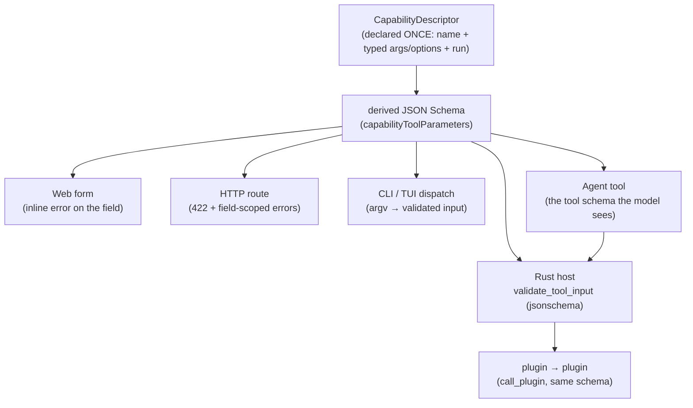
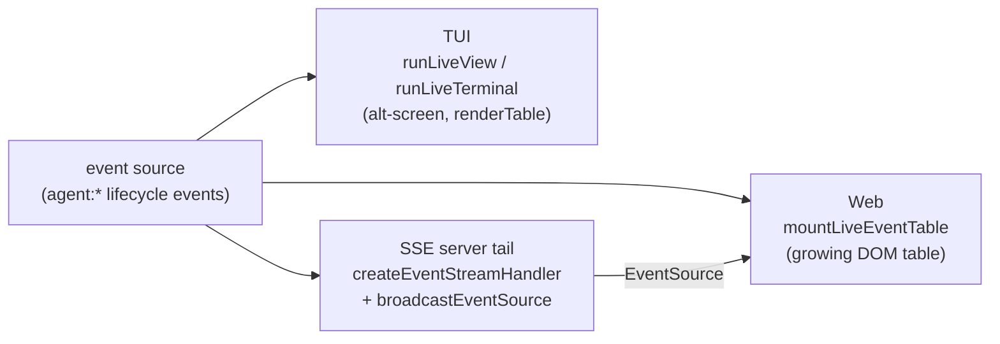

# Declare Once, Project Everywhere — the Refarm invariant

> The defining property of the capability substrate: a capability is **declared once** (a typed verb) and
> **projects to every surface** — CLI, TUI, a web form, HTTP, an agent tool, plugin→plugin — where each
> validates the **same derived JSON Schema identically**. This document is the architecture of that claim
> and of the primitives that make it concrete, with an honest ledger of what is _proven_, what is a
> _seam_, and what stays _manual_.

Companion docs: [`tui-subsystem.md`](tui-subsystem.md) (the TUI layout + live-view engine),
[`manual-test-plan.md`](manual-test-plan.md) (the human-only checks), [`DEVOPS.md`](DEVOPS.md)
(`pnpm run verify` + the pre-push gate).

---

## 1. One declaration, six surfaces

A `CapabilityDescriptor` carries **zero surface vocabulary** — a name, a summary, typed `args`/`options`,
and a pure `run()` that returns a JSON envelope. Each surface is a **blind projector** over that one
declaration. The args/options derive **one** JSON Schema (`capabilityToolParameters`); every surface
validates against it.

The TS surfaces validate with **Ajv** (`validateCapabilityArgs` → `validateAgainstSchema`); the Rust host
(the agent-tool leg's `invoke_tool` and the SPI `call_plugin` leg) validates the **same schema bytes** with
the `jsonschema` crate. One declaration, one schema, one rejection — on every surface.

## 2. Proof, not assertion

The claim is only worth what proves it. It is proven at three ascending levels:

| Level | What it proves | Where |
| --- | --- | --- |
| **Per-surface unit** | one bad input (`limit="5.5"`) is rejected by the validator, CLI/TUI dispatch, HTTP (422), the web form, and the agent schema — all naming the field `limit` | `capability-homestead-surface/src/invariant.test.ts` |
| **Cross-language fixture** | the TS (Ajv) and Rust (`jsonschema`) validators reject the **same** input against the **same** schema bytes, naming the **same** field | `capabilities-v1/fixtures/plugin-surface-verbs.json` (`validation` cases) driven by `verb-schema-validation.test.ts` (TS) **and** `tractor`'s `validate_tool_input_matches_ts_conformance_fixture` (Rust) |
| **Live end-to-end** | an agent invokes a plugin verb as a tool through the **real WASM runtime** with a bad arg and the host rejects it at the capability-tools boundary, **naming the field**, before any dispatch | `tractor/tests/agent_harness.rs::harness_bad_tool_input_rejected_naming_field_through_wasm` (CI `wasm-component-tests`) |

### The coercion caveat (a deliberate, documented difference)

The TS Ajv coerces string form-input (`limit="5"` → `5`, because a `<input>` yields strings); the Rust host
does **not** coerce (an agent/plugin sends already-typed JSON). This is a form affordance, not a schema
difference — so the shared cross-language cases are **coercion-stable** (e.g. `limit="5.5"`/`"abc"` are
non-numeric strings both reject; a bare `"5"` would diverge and is intentionally absent).

## 3. The live-view engine — one source→render→grow, three sinks

"Watch the machine work" is the same engine projected to three surfaces. A **source** yields events; a
**render** turns the accumulated events into a frame; the frame **grows** as events arrive.

| Concern | TUI | Web | Server (SSE) |
| --- | --- | --- | --- |
| source | `LiveSource` (pull) / `pollingSnapshotSource` | `LiveEventSource` (push) / `arrayEventSource` | `EventStreamSource` / a file poll |
| render + grow | `runLiveView` + `renderTable` | `mountLiveEventTable` + `renderTableHtml` | one `data:` frame per event |
| real driver | `runLiveTerminal` (SIGINT-safe) | `eventSourceStream` (native auto-reconnect) | `dgk serve` → `GET /agent/events` |
| fan-out | — | — | `broadcastEventSource` (one poll → N browsers, history replay) |

T1's `agent-watch` (TUI) and `agent-activity` (web) are the two consumers of this one engine; `dgk serve`
mounts the SSE tail so a browser's `followAgentActivity()` grows the table live as a run progresses.

## 4. The invariant as a generator — `scaffold`

Because the invariant is mechanical, it is **generated**. `buildCapabilityScaffold(spec)` (and the
`pnpm run scaffold:capability` CLI) emits a `CapabilityDescriptor` declared once **plus** a cross-surface
test that asserts one invalid input is rejected identically across the validator, CLI/TUI dispatch, HTTP
(422), and the agent schema. Every new capability is born with that coverage. A committed golden sample
(`capabilities-v1/src/scaffold-sample/greet.*`) is generated and **runs in CI**, proving the emitted code
type-checks, lints, and its cross-surface test passes.

## 5. Declare the theme once, too

The colour half of the multi-surface story: a DS token theme (DTCG → `projectThemeToTui`) declared once on
the host (`CapabilityHostDefinition.tuiTheme`) colours **both** TUI faces — `dashboard` and `status-panel` —
via `dashboardColorsFromTuiTheme` / `statusColorsFromTuiTheme` (`foreground`→label, `primary`→accent,
`error`/`warning`/`success`→severity). One declared theme, consistent faces.

## 6. Honest status

| Piece | Status |
| --- | --- |
| Cross-surface **validation** (6 surfaces) | **Proven** — unit + cross-language fixture + live WASM e2e |
| Live-view engine (TUI replay + tail; web replay; SSE server tail on `dgk serve`) | **Proven** — unit + jsdom + a real-server integration test + a live `dgk serve` curl smoke |
| Scaffold generator | **Proven** — generator + CLI unit tests + a CI-run golden sample |
| Theme → TUI faces | **Proven** — token→colorizer unit tests + a token→rendered-panel e2e test |
| The real terminal (keyboard, SIGINT restore), a real browser page, a live agent run | **Manual** — [`manual-test-plan.md`](manual-test-plan.md) |
| A live SSE tail against a running agent (two terminals) | **Manual** — the only part a headless suite can't drive |

## 7. Where it lives

| Concern | Package / file |
| --- | --- |
| Descriptor + schema + validators | `packages/capabilities` (`types`, `agent-projector`, `arg-validator`, `http-projector`, `event-stream`) |
| Rust host validation | `packages/tractor` (`host/host_effects_bridge/capability_tools.rs`) |
| Cross-language fixture | `packages/capabilities-v1/fixtures/plugin-surface-verbs.json` |
| Live-view engine (TUI) | `packages/surface-terminal` (`tui-live`, `tui-status`, `tui-dashboard`) |
| Live-view engine (web + SSE consume) | `packages/capability-homestead-surface` (`live-events`) |
| Scaffold | `packages/capabilities/src/scaffold.ts` + `scripts/scaffold-capability.mjs` |
| Theme pipeline | `packages/ds` (`theme-tui`, tokens) + the `*ColorsFromTuiTheme` seams |
| T1 consumers | `examples/devbench-t1` (`agent-watch`, `web/agent-activity`, `agent-event-stream`, `tui-theme`) |

> _Active Inference framing:_ every surface is an **observation** derived from the same generative model
> (the declaration). Keeping the projection thin and the schema single-sourced minimises surprise: a change
> to the declaration cannot make two surfaces disagree, because there is only one thing to disagree with.
