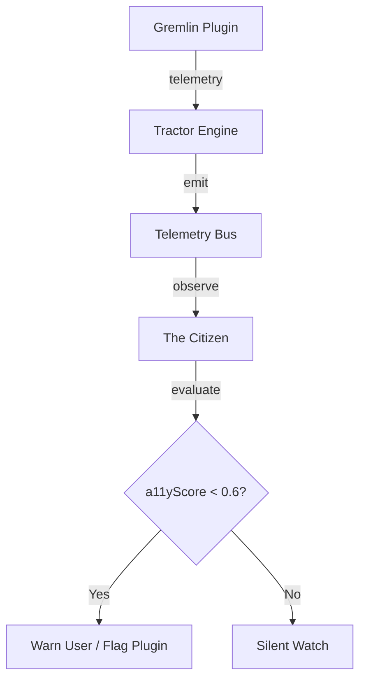

# System Plugin: The Citizen (O Cidadão)

**Status**: Design Prototype (Phase 10)  
**Role**: UI/UX Auditor & User Protection Guardian

## Mission
To monitor the "Good Citizenship" of Refarm plugins. It acts as a passive observer of the Sovereign Graph and Engine Telemetry, intervening only when a plugin violates basic human-safety parameters.

## Responsibilities
1. **Accessibility Scorekeeper**: Consumes `UITelemetry` nodes. If a plugin's `a11yScore` drops below a threshold (e.g., 0.6), The Citizen triggers a visual warning.
2. **DOM Pollution Guard**: Monitors the `domPollution` metric. Identifies plugins that are making unauthorized changes to the global document object outside their designated slots.
3. **Strobe Sentinel**: Real-time monitoring for rapid flashing. If detected, it signals the `StudioShell` to apply a global transition-dampening filter.
4. **The "Seizure-Free" Badge**: Certifies plugins in the marketplace based on their historical telemetry performance.

## Design Pattern (Reactive Observer)
The Citizen does not "sit" between the Tractor and the Plugin. Instead, it **observes** the pulse:

## UI/UX Integration
- **Badge in Status Bar**: A small icon in the Homestead status bar representing "System Health".
- **Gremlin Alert**: A non-intrusive toast that explains: *"Plugin X is causing significant DOM pollution. This might impact your interface performance."*
- **Sovereign Evidence**: Every violation is stored as a node in the Graph, providing a "Public Record" of a plugin's behavior (Sovereign Auditing).
