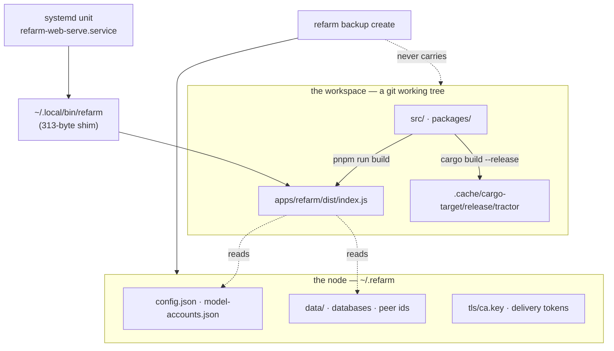

# What a node is made of, and which parts are the working tree

Three things on this machine look separate and are not. Naming them is the whole
point of this document — everything else follows from the picture.



The node's **state** lives in `~/.refarm`. The node's **code** lives in the
working tree. The launcher in `~/.local/bin` makes the second look like the
first.

## The chain, measured

```
systemd unit → ~/.local/bin/refarm → ~/github/refarm/apps/refarm/dist/index.js
```

`~/.local/bin/refarm` is a 313-byte shim that execs the repo's build output. So a
supervised service named after a path under `~/.local/bin` executes code from a
git tree — and the Rust runtime is stricter still: its launcher resolves *repo
script if present, else the binary on PATH*, and `tractor` is not on PATH here.
The fallback exists and is unreachable.

## Four consequences, each derived

| | |
| --- | --- |
| **A build rewrites what live services run.** | `pnpm run build` replaces `dist/`. A service restarting mid-build reads a partial tree; a failed build leaves the node running nothing. |
| **A branch switch changes them silently.** | `git checkout` is a development action with production effect. |
| **A backup restores a node that cannot run.** | `backup create` carries 32 files of configuration, credentials-to-re-obtain and databases. None of them is code. |
| **A supervised runtime would encode a repo path.** | Declaring the runtime means writing `bash scripts/tractor-start.sh` — a path inside the tree — into a unit file. |

## This is not a bad install

Running the working tree is the fastest loop there is, and this repository is the
operator's own instrument: editing it and using it in the same breath is the
point. The defect is that **nothing said the two were the same thing**, so a
development action and a node action were indistinguishable until one broke the
other.

## What now says it

- `refarm health` reports `nodeSubstrate` and, for a working tree, explains the
  coupling. **Not counted in `issueCount`** — nothing is broken, and a gate that
  goes red about a legitimate choice teaches its reader to skim red.
- The backup manifest carries `substrate: { kind, executes, repository,
  included: false }`. Recorded either way, like `secrets.included`: *"this bundle
  is complete"* and *"there was nothing else to carry"* are different statements.

## What separates them

An **installed** substrate: the node runs a promoted tree, and the working tree is
where new versions are built and promoted deliberately. This is now the case on
this machine, and `refarm node install` is how it gets there.

**It was reachable, and measured.** An earlier version of this document called it a
packaging project on the grounds that a runtime loader made copying `dist/`
insufficient. That was asserted from a quick read and is wrong:

| | |
| --- | --- |
| the installable tree | 45MB of `dist` + 127 `package.json` |
| external runtime deps, whole workspace | 15 |
| `pnpm deploy --prod --legacy` | exit 0, self-contained, `node_modules/@refarm.dev/*` populated |

That tree almost runs, and fails on **one precise thing**:

```
Cannot find module '…/@refarm.dev/root/dist/fetch-with-timeout.js'
```

`packages/root` declares `files: ["dist/index.js", "dist/index.d.ts"]`, and the
built CLI deep-imports a path that list does not ship. A deep import bypasses
`exports` and depends entirely on `files` — and **26 workspace packages carry a
restrictive `files` list**, so each is a latent instance of the same failure,
invisible while everything resolves through the workspace.

This is the rope the 0.1.0 release already names, measured here as *shipped*-dist
rather than *built*-dist, with a reproduction. Fixing those declarations was the
first slice of the install path **and** the release's own blocker — one fix,
both. Six packages were corrected and
`scripts/ci/package-files-closure-gate.mjs` now reports every offender rather
than the first.

## `refarm node install`

```
assemble  →  restore the checkout  →  verify by RUNNING it  →  repoint  →  record
```

**The order is the content.** Each step exists because skipping it produced a
failure that looked like success:

- **Verify by running it.** An install that reports success without executing
  what it installed is the shape of a backup that fails on the day it is needed.
  Twice while proving this path, a tree that "built" could not start.
- **Restore the checkout, immediately.** `pnpm deploy --legacy` leaves the source
  workspace's recorded dependency status stale, and afterwards every `pnpm run`
  and `pnpm exec` there aborts — the repo's own gates included. The install
  resyncs with the same resolved binary that caused it, *before* verification, so
  even a failed verify leaves a working checkout. ISS-155.
- **Repoint, do not ask.** `operation-consent-v1` splits on one question: is this
  proposed *on the operator's behalf*, or is it what they typed? Repointing the
  launcher is not beyond `node install` — it *is* `node install`, and
  `--verify-only` exists for whoever wants the tree without it. So the change is
  recorded in full (before/after, who, when, an undo that executes) and nothing
  is asked. A new release therefore installs with nobody at the keyboard.

**What it reports** is three states, never two:

| | |
| --- | --- |
| `installed` | the launcher points at the new tree; `<launcher>.previous` holds the old one |
| `verified` | assembled and proven to run; the launcher was not touched (`--verify-only`) |
| `refused` | said why, and left the failed tree on disk for whoever has to debug it |

…plus `checkout: restored \| stale`, because a stale checkout breaks the *next*
command the operator runs there and nothing else would explain why.

**Where the tree goes:** `~/.local/lib/refarm/<version>-<commit>` — deliberately
**not** under `~/.refarm`, which `backup create` walks. A node's identity and a
node's code are different things, and a backup that swallowed 434MB of
reproducible artifacts would be the same category error this document opens with.

## The bootstrap: a fix to the installer cannot install itself

MEASURED 2026-08-26, three times in one session, the third time by someone who had already
written the other two down.

`refarm` on `PATH` executes the INSTALLED tree. So `refarm node install` runs the installer that
is already installed — not the one in the checkout. A change TO the installer therefore cannot
take effect through itself:

    refarm node install                          -> 0.1.0-31f1093d          (old installer, old label)
    node apps/refarm/dist/index.js node install  -> 0.1.0-31f1093d-aac963a7 (new installer, new label)

The first run reports `installed` and succeeds. It simply produces what the OLD code produces,
and the only tell is the output — here, a label missing the content digest the new installer adds.

**So: when the change being installed is a change to the install path, invoke the built CLI
directly.** `node apps/refarm/dist/index.js node install`. Once that lands, `refarm node install`
is the new one and the bootstrap is over until the next such change.

THE SAME SHAPE BIT THREE OTHER THINGS THE SAME DAY, and it is worth naming as one class rather
than four incidents: a `plugin --help` consulted from a stale `dist` and read as "the command does
not exist"; a live `refarm ask` refusal that was the pre-fix message because the node ran code
eight commits old; and a `plugin status` whose new columns were absent because the launcher still
pointed at the previous tree. In every case the artifact answered honestly for the code it
contained, and the conclusion drawn about the SOURCE was wrong.

The rule that survives all four: **before concluding anything from a `refarm` command about code
you just changed, know which tree answered.** `refarm health` prints it — the installed label
beside the checkout's HEAD — and `health --json` carries `results.nodeSubstrate.identity.commit`
against `results.checkoutHead`.

## The separation was not achieved — measured 2026-08-22

Everything above was true and the node was still executing the working tree.

`pnpm deploy` does not copy. It **hardlinks** workspace packages into the
assembled tree, so `~/.local/lib/refarm/<label>` shared inodes with
`packages/<pkg>/dist`. The consequences are the same four this document opens
with, minus the one thing that made them bearable: nothing said so. The launcher
said the opposite, in a comment, in the file.

The chain of events, each part measured:

| when | what |
| --- | --- |
| 19/08 23:26 | `node install` assembles `0.1.0-5b4810a9`, verifies it by running it, repoints. Correct at that instant. |
| 20/08 00:58 | a `tsc` run in the checkout rewrites `index.js` **in place**. Same inode — so the installed tree's copy changes too. |
| 20/08 01:15 | the same commit adds `bindings.ts`. A **new** file: hardlinks are per-file, so it never reaches the tree. |
| — | the installed node now imports a module absent from its own tree. Live processes, already loaded, keep running. |
| 21/08 09:18 | reboot. Every unit reloads from disk and dies. `web-serve` retries six times and gives up. |
| 22/08 20:25 | found. `credential-renew` has failed **4420 times** in the meantime, silently. |

**The instrument could not see it.** `readNodeSubstrate` classifies by one
question — is there a `.git` above the entrypoint? `~/.local/lib/refarm/…` has
none, so it answered `installed`, `describeSubstrate` returned `null`, and
`refarm health` had nothing to say while the node ran working-tree bytes.

**No flag prevents it.** Measured, each producing a hardlink anyway:
`--config.package-import-method=copy`, `npm_config_package_import_method=copy`,
and `--config.inject-workspace-packages=true` (the non-legacy deploy refuses
without the last). Hardlinking is the store's design, not an oversight.

### What the install does now

A step between assembling and verifying: **give the tree its own storage, then
prove it has it.**

- Only the 77 materializations that came from a workspace path are copied. The
  other 366 are registry tarballs hardlinked to pnpm's store — which this repo
  keeps inside the checkout (`.npmrc`, `store-dir=.pnpm-store`) — and nothing
  ever rewrites a content-addressed file. Copying them would buy no independence
  and cost the whole tree in disk.
- **The proof does not reuse the selection.** The first version of this shipped
  and did not work: pnpm appends a peer hash whose suffix carries its own `@`
  (`@refarm.dev+cli@file+packages+cli_@emnapi+core@1.11.1_…`), the rule read the
  separator from the wrong end, skipped the package, and left **1081 files**
  hardlinked while the install reported itself independent. The unit tests passed
  throughout — they used names without peers. Only a measurement taken *outside
  the tool* found it. So the verdict now indexes the checkout's own files by
  inode and scans the assembled tree against them: ~0.15s for 65,545 against
  16,552, and a naming bug surfaces as a failure instead of a silence.
- A tree that is still coupled is **refused**, and the launcher is left alone.

Verified on the operator's node 2026-08-22: `0.1.0-c58ae2ba`, 16,552 files, **0
shared with the checkout**, measured independently of the install that made it.

## What the tree knows about itself, and when it says so

Closing the coupling above left two ends open, and they are one requirement: the
node must not be coupled to the repository, **and updating it must be a deliberate
act** — from a published release or from local development.

### The label stopped naming a commit it does not contain (ISS-158)

`installVersionLabel`'s purpose is stated in its own docstring: two installs of
"0.1.0" from different commits are different trees, and an operator rolling back has
to tell them apart in a directory listing. It could not. The label comes from
`git HEAD`; the tree comes from the working tree's `dist/`. Measured on the install
that closed the coupling:

```
installed 0.1.0-c58ae2ba carries materializeWorkspacePackages  -> yes
git show c58ae2ba:apps/refarm/src/commands/node-install.ts     -> no such symbol
```

A label that is nearly-but-not-quite traceable is worse than one claiming nothing:
it invites the trust it cannot carry. **Refusing a dirty checkout would have been the
wrong fix** — installing from one is the development loop this repository exists for.
The name simply stops asserting what it does not know: `-dirty`, as `git describe`
has spelled it for years.

**"Could not tell" collapses into dirty**, deliberately. A clean tree wrongly marked
dirty is an alarm; a dirty tree wrongly marked clean is a false assurance travelling
into a label someone rolls back by.

And the tree now carries `installed-node.json` at its root, because a directory name
cannot hold *when*, and cannot say *which kind* of dirty:

```json
{ "label": "0.1.0-528fd2df", "version": "0.1.0", "commit": "528fd2df",
  "checkout": { "dirty": false, "because": "the checkout matched its commit." },
  "installedAt": "2026-08-23T04:09:14.068Z",
  "repository": "/home/s095407044/github/refarm" }
```

`checkout` is the whole verdict rather than a boolean: *"one file changed"* and
*"git would not answer"* both produce `-dirty` in the label, and folding them in the
record too would repeat the defect one level down. Two dirty installs of one commit
still share a path — said out loud, because a label that quietly stops being unique
is how this happened the first time.

### The node says when it has aged (ISS-159)

`describeSubstrate` returned `null` for an installed node because that was the goal
state and had nothing to explain. **Reaching a goal state does not end the question.**
The node ran `0.1.0-5b4810a9` while the checkout moved ten commits past it and every
surface was silent.

| | |
| --- | --- |
| node current | **silent** — a line that is always present is a line nobody reads, and it would bury the one that matters |
| checkout moved on | names both ends, `severity: info` — ageing is legitimate, and a gate that reddens over it teaches its reader to skim red |
| build was dirty | said **even when the commits match**: it was assembled from a working directory that held changes, so matching `HEAD` proves nothing about what went in |
| no identity file | silent — every tree assembled before 2026-08-23 has none, and that is not a fault |
| no checkout beside it | silent — a phone, a Raspberry Pi, a released install. *"Up to date"* would be a claim nothing measured |

The **data** is always in the substrate; only the prose is conditional.

**The identity carries its repository**, which is the defect this would otherwise have
shipped. A node is administrable from anywhere and this operator has two declared
workspaces; reading the node's commit beside an unrelated repository's `HEAD` would
produce a confident sentence about two histories that never met. The head is read
only when `rev-parse --show-toplevel` resolves to the tree the node was assembled
from.

## Related

- [`SANDBOX_NODE.md`](SANDBOX_NODE.md) — a second node that isolates **state**
  and explicitly does not isolate code. That document's *"What is NOT isolated"*
  already named this fact; what it did not name is the consequence for the
  operator's own node.
- [`CONFIG_TIERS.md`](CONFIG_TIERS.md) — which config key belongs to the node and
  which to a workspace. The same boundary, one layer up.
