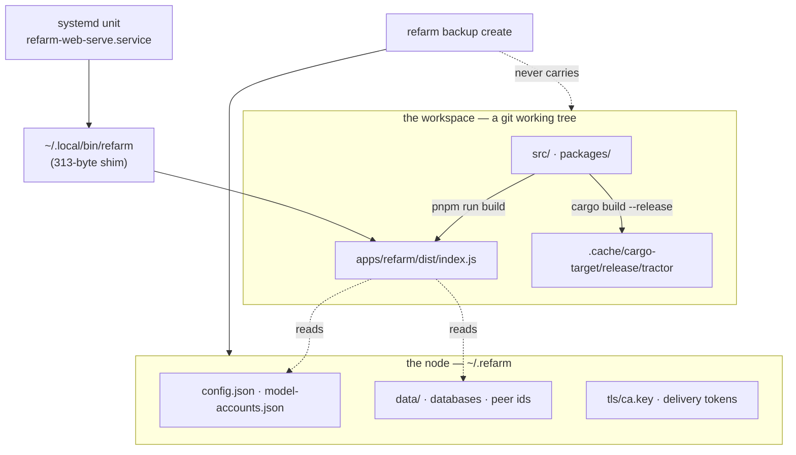

# What a node is made of, and which parts are the working tree

Three things on this machine look separate and are not. Naming them is the whole
point of this document — everything else follows from the picture.



The node's **state** lives in `~/.refarm`. The node's **code** lives in the
working tree. The launcher in `~/.local/bin` makes the second look like the
first.

## The chain, measured

```
systemd unit → ~/.local/bin/refarm → ~/github/refarm/apps/refarm/dist/index.js
```

`~/.local/bin/refarm` is a 313-byte shim that execs the repo's build output. So a
supervised service named after a path under `~/.local/bin` executes code from a
git tree — and the Rust runtime is stricter still: its launcher resolves *repo
script if present, else the binary on PATH*, and `tractor` is not on PATH here.
The fallback exists and is unreachable.

## Four consequences, each derived

| | |
| --- | --- |
| **A build rewrites what live services run.** | `pnpm run build` replaces `dist/`. A service restarting mid-build reads a partial tree; a failed build leaves the node running nothing. |
| **A branch switch changes them silently.** | `git checkout` is a development action with production effect. |
| **A backup restores a node that cannot run.** | `backup create` carries 32 files of configuration, credentials-to-re-obtain and databases. None of them is code. |
| **A supervised runtime would encode a repo path.** | Declaring the runtime means writing `bash scripts/tractor-start.sh` — a path inside the tree — into a unit file. |

## This is not a bad install

Running the working tree is the fastest loop there is, and this repository is the
operator's own instrument: editing it and using it in the same breath is the
point. The defect is that **nothing said the two were the same thing**, so a
development action and a node action were indistinguishable until one broke the
other.

## What now says it

- `refarm health` reports `nodeSubstrate` and, for a working tree, explains the
  coupling. **Not counted in `issueCount`** — nothing is broken, and a gate that
  goes red about a legitimate choice teaches its reader to skim red.
- The backup manifest carries `substrate: { kind, executes, repository,
  included: false }`. Recorded either way, like `secrets.included`: *"this bundle
  is complete"* and *"there was nothing else to carry"* are different statements.

## What would separate them

An **installed** substrate: the node runs a real binary or a promoted snapshot,
and the working tree is where new versions are built and promoted deliberately.

It is a packaging project rather than a slice — the CLI resolves workspace
packages through a runtime loader (`scripts/farmhand-node-loader.mjs`), so
copying `dist/` is not enough. That work is tracked as the 0.1.0 release; ISS-154
carries the decision and its costs.

## Related

- [`SANDBOX_NODE.md`](SANDBOX_NODE.md) — a second node that isolates **state**
  and explicitly does not isolate code. That document's *"What is NOT isolated"*
  already named this fact; what it did not name is the consequence for the
  operator's own node.
- [`CONFIG_TIERS.md`](CONFIG_TIERS.md) — which config key belongs to the node and
  which to a workspace. The same boundary, one layer up.
