# Plugin Developer Playbook — Build Your First Refarm Plugin

> **Level**: Beginner  
> **Time**: 30 minutes  
> **Languages**: TypeScript, Go, Rust  
> **Output**: A working plugin that installs in Refarm

---

## What You'll Learn

How to:

1. Clone a plugin template (TypeScript / Go / Rust)
2. Implement the WIT contract (`refarm-sdk.wit`)
3. Compile to WASM with capability-based security
4. Test locally before publishing

---

## Prerequisites

- Node.js 18+ (for TypeScript tooling)
- For Go: Go 1.20+ + `tinygo` compiler
- For Rust: Rust 1.70+ + `wasm32-unknown-unknown` target
- Refarm v0.4.0+ installed locally

---

## Part 1: Understand the Plugin Contract

Every Refarm plugin implements a **WIT (WebAssembly Interface Type)** contract defined in [`wit/refarm-sdk.wit`](../wit/refarm-sdk.wit).

This contract defines:

- **What the plugin exports** (`integration` interface): `setup`, `ingest`, `push`, `teardown`, `metadata`
- **What the tractor offers** (`tractor-bridge` interface): `storeNode`, `fetch`, `log`, `requestPermission`
- **WASI Alignment**: Plugins are compiled as WASI-compatible components. For network (`wasi-http`) and filesystem (`wasi-filesystem`) access, use standard WASI syscalls, which the Tractor Microkernel intercepts and gates based on your declared capabilities.
- **Security model**: Plugins are sandboxed and can only call tractor functions or WASI syscalls they have capabilities for.

### Plugin Lifecycle



```
┌─────────────┐
│   setup()   │  Request capabilities (e.g., network access)
├─────────────┤
│  ingest()   │  Fetch data, normalise to JSON-LD, store via tractor
├─────────────┤
│   push()    │  [Optional] Send data back out to external service
├─────────────┤
│ teardown()  │  Cleanup (e.g., close connections)
└─────────────┘
```

---

## Part 1.5: Supporting Guest Users (Optional but Recommended)

Refarm allows **guest sessions** — users without a Nostr keypair who want to try or collaborate. The key insight: **Guest = no keypair, NOT no storage.** Guests can choose any storage tier (ephemeral, persistent, or synced).

### Should Your Plugin Support Guests?

| Plugin Type | Guest Support | Why |
|-------------|---------------|-----|
| **Collaborative** (whiteboard, docs) | ✅ Yes | Guests participate in shared boards |
| **Bridge** (Signal, Matrix) | ❌ No | Requires identity for API authentication |
| **Backup/Export** | ✅ Yes | Guests with persistent storage CAN backup |
| **Query/Search** | ✅ Yes | Guests have data to search (if persistent) |
| **Nostr Publisher** | ❌ No | Requires keypair for signing events |

### Declaring Guest Support in Metadata

```typescript
metadata(): PluginMetadata {
  return {
    name: "Whiteboard Plugin",
    version: "1.0.0",
    guestMode: {
      supported: true,
      capabilities: ["read", "write"],
      restrictions: ["no-nostr-publish"]  // Only signing-dependent ops
    }
  };
}
```

### Detecting Guest Users at Runtime

```typescript
async setup(): Promise<void> {
  // Query tractor for user identity
  const identity = await this.bridge.getIdentity();
  
  if (identity.type === "guest") {
    // User has no keypair — cannot sign events
    // But CAN have persistent storage (check storageTier)
    const tier = identity.storageTier; // "ephemeral" | "persistent" | "synced"
    this.bridge.log("info", `[plugin] Guest user, storage: ${tier}`);
    this.isGuest = true;
  } else {
    this.bridge.log("info", `[plugin] User is @${identity.pubkey}`);
    this.isGuest = false;
  }
}
```

### Adjusting Behavior for Guests

```typescript
async ingest(): Promise<number> {
  if (this.isGuest) {
    // Guests can ingest data IF they have persistent storage
    const identity = await this.bridge.getIdentity();
    if (identity.storageTier === "ephemeral") {
      this.bridge.log("warn", "[plugin] Ephemeral guest — data won't persist");
    }
    // Still allow ingest — storage tier is the user's choice
  }
  
  // Normal ingest flow for all users
  const data = await this.fetchData();
  return this.storeNodes(data);
}
```

### Example: Collaborative Whiteboard Plugin

```typescript
// Guest can add sticky notes — same API as permanent users
async push(payload: string): Promise<void> {
  const node = JSON.parse(payload);
  const identity = await this.bridge.getIdentity();
  
  if (identity.type === "guest") {
    // Guest notes use vaultId as owner
    node["refarm:owner"] = identity.vaultId;
    node["@id"] = `urn:${identity.vaultId}:note-${Date.now()}`;
  } else {
    // Permanent user notes use pubkey as owner
    node["refarm:owner"] = identity.pubkey;
    node["@id"] = `urn:${identity.pubkey}:note-${Date.now()}`;
  }
  
  // Same storeNode API for both — storage tier is handled by tractor
  await this.bridge.storeNode(JSON.stringify(node));
}
```

See [ADR-006: Guest Mode](../specs/ADRs/ADR-006-guest-mode-collaborative-sessions.md) for full design.

---

## Part 2: Choose Your Language

### Option A: TypeScript (Easiest)

**Why**: Runs directly in tests, no compilation step yet.

```bash
# Clone template
git clone --depth 1 https://github.com/aretw0/refarm.git
cd refarm/examples/matrix-bridge

# Install
npm install

# Build to JS (no WASM yet)
npm run build

# Test locally (see examples/matrix-bridge/test/)
npm test
```

**Next step**: TypeScript plugin can be run in a Web Worker directly.

---

### Option B: Go → WASM

**Why**: Go is ergonomic, small WASM output, good stdlib.

**Setup TinyGo**:

```bash
# macOS
brew install tinygo

# Linux
wget https://github.com/tinygo-org/tinygo/releases/download/v0.30.0/tinygo0.30.0.linux-amd64.tar.gz
tar xzf tinygo0.30.0.linux-amd64.tar.gz
export PATH=$PATH:$(pwd)/tinygo/bin

# Windows (or use WSL)
choco install tinygo
```

**Create a Go plugin**:

```bash
mkdir plugins/my-go-bridge
cd plugins/my-go-bridge

cat > main.go << 'EOF'
package main

import (
 "encoding/json"
 "fmt"
)

// Implement the WIT contract manually or via generated bindings
type PluginMetadata struct {
 Name                   string   `json:"name"`
 Version                string   `json:"version"`
 Description            string   `json:"description"`
 SupportedTypes         []string `json:"supportedTypes"`
 RequiredCapabilities   []string `json:"requiredCapabilities"`
}

// Export setup function (called by tractor)
//export setup
func setup() {
 log("info", "[my-go-bridge] setup() called")
}

// Export ingest function
//export ingest
func ingest() int32 {
 log("info", "[my-go-bridge] ingest() called")
 // TODO: Fetch data, normalise, store via tractor bridge
 return 0
}

// Helper: log to tractor
func log(level, msg string) {
 // In a real implementation, this would call a tractor-provided function
 fmt.Printf("[%s] %s\n", level, msg)
}

func main() {}
EOF

# Compile to WASM
tinygo build -o plugin.wasm -target wasm main.go
```

**Result**: `plugin.wasm` (typically 50-200KB)

**See also**: [TinyGo WIT Bindgen](https://tinygo.org/docs/guides/webassembly/)

---

### Option C: Rust → WASM

**Why**: Strongest type safety, mature WASM ecosystem, excellent error handling.

**Setup**:

```bash
# Install Rust (if not already)
curl --proto '=https' --tlsv1.2 -sSf https://sh.rustup.rs | sh

# Add WASM target
rustup target add wasm32-unknown-unknown

# Install wasm-tools for WIT binding
cargo install wasm-tools
```

**Create a Rust plugin**:

```bash
cargo new --lib plugins/my-rust-bridge
cd plugins/my-rust-bridge

cat > Cargo.toml << 'EOF'
[package]
name = "my-rust-bridge"
version = "0.1.0"
edition = "2021"

[dependencies]
serde = { version = "1.0", features = ["derive"] }
serde_json = "1.0"

[lib]
crate-type = ["cdylib"]
EOF

cat > src/lib.rs << 'EOF'
use serde::{Deserialize, Serialize};

#[derive(Debug, Serialize, Deserialize)]
pub struct PluginMetadata {
    pub name: String,
    pub version: String,
    pub description: String,
    pub supported_types: Vec<String>,
    pub required_capabilities: Vec<String>,
}

// Export setup function (called by tractor via WIT)
#[no_mangle]
pub extern "C" fn setup() -> i32 {
    log_info("[my-rust-bridge] setup() called");
    0 // Success
}

// Export ingest function
#[no_mangle]
pub extern "C" fn ingest() -> i32 {
    log_info("[my-rust-bridge] ingest() called");
    // TODO: Fetch data, normalise, store via tractor bridge
    0
}

fn log_info(msg: &str) {
    // In a real implementation, this would call a tractor-provided function
    eprintln!("[info] {}", msg);
}
EOF

# Compile to WASM
cargo build --release --target wasm32-unknown-unknown

# Result: target/wasm32-unknown-unknown/release/my_rust_bridge.wasm
```

**See also**: [Rust WASM Book](https://rustwasm.github.io/)

---

## Part 3: Implement the Plugin

All plugins follow the same flow:

### 1. Define Metadata

```typescript
// TypeScript
metadata(): PluginMetadata {
  return {
    name: "My Bridge",
    version: "1.0.0",
    description: "Syncs data from protocol X into Refarm",
    supportedTypes: ["Message", "Person", "ChatRoom"],
    requiredCapabilities: ["network:https://api.example.com"],
  };
}
```

### 2. Request Capabilities in `setup()`

```typescript
async setup(): Promise<void> {
  const granted = this.bridge.requestPermission(
    "network:https://api.example.com",
    "My Bridge needs to fetch messages from Example API"
  );
  if (!granted) throw new Error("Permission denied");
}
```

### 3. Fetch & Normalise Data in `ingest()`

```typescript
async ingest(): Promise<number> {
  // 1. Fetch via tractor bridge (capability-gated)
  const response = await this.bridge.fetch({
    method: "get",
    url: "https://api.example.com/messages",
    headers: [["Authorization", `Bearer ${token}`]],
    body: null,
  });

  // 2. Parse response
  const data = JSON.parse(new TextDecoder().decode(response.val.body));

  // 3. Normalise to JSON-LD (required by sovereign graph schema)
  const jsonLdNode = {
    "@context": "https://schema.org/",
    "@type": "Message",
    "@id": `urn:my-bridge:msg-${data.id}`,
    text: data.body,
    dateSent: new Date(data.timestamp).toISOString(),
    "refarm:sourcePlugin": "my-bridge",
  };

  // 4. Store via tractor bridge
  const result = await this.bridge.storeNode(JSON.stringify(jsonLdNode));
  if (result.tag === "ok") return 1;
  else throw new Error(`Store failed: ${result.val}`);
}
```

### 4. [Optional] Push Data in `push()`

```typescript
async push(payload: string): Promise<void> {
  const node = JSON.parse(payload);
  if (node["@type"] !== "Message") throw new Error("Unsupported type");

  // Send message back to external service
  await this.bridge.fetch({
    method: "post",
    url: "https://api.example.com/send",
    headers: [["Content-Type", "application/json"]],
    body: new TextEncoder().encode(JSON.stringify(node)),
  });
}
```

### 5. Cleanup in `teardown()`

```typescript
teardown(): void {
  // Close connections, cleanup resources
  this.bridge.log("info", "[my-bridge] Shutting down");
}
```

---

## Part 4: Test Your Plugin

### TypeScript: Unit Tests

```typescript
// test/matrix-bridge.test.ts
import { describe, it, expect } from "vitest";
import MatrixBridgePlugin from "../src/index";

describe("MatrixBridgePlugin", () => {
  // Mock tractor bridge
  const mockBridge = {
    storeNode: async (json: string) => ({ tag: "ok", val: "node-id-1" }),
    fetch: async (req) => ({
      tag: "ok",
      val: { status: 200, headers: [], body: new Uint8Array() },
    }),
    log: () => {},
    requestPermission: () => true,
  };

  it("should normalise Matrix rooms to JSON-LD", async () => {
    const plugin = new MatrixBridgePlugin(mockBridge);
    await plugin.setup();
    const count = await plugin.ingest();
    expect(count).toBeGreaterThan(0);
  });
});
```

### Go: Manual Testing

```go
// main_test.go
package main

import "testing"

func TestSetup(t *testing.T) {
    setup()
    // Assert no panic
}

func TestIngest(t *testing.T) {
    count := ingest()
    if count < 0 {
        t.Errorf("expected count >= 0, got %d", count)
    }
}
```

### Rust: Cargo Tests

```rust
#[cfg(test)]
mod tests {
    use super::*;

    #[test]
    fn test_setup() {
        let result = setup();
        assert_eq!(result, 0);
    }
}

// Run: cargo test
```

---

## Part 5: Build & Package

### TypeScript to WASM

For now, TypeScript plugins can be bundled as JS and run in Web Workers.
Future: TypeScript → Binaryen → WASM compilation.

```bash
npm run build
npm pack
# → refarm-matrix-bridge-1.0.0.tgz
```

### Go to WASM

```bash
tinygo build -o plugin.wasm -target wasm main.go

# Optional: Optimize size
wasm-opt -O4 plugin.wasm -o plugin-opt.wasm
```

### Rust to WASM

```bash
cargo build --release --target wasm32-unknown-unknown

# Optimize
wasm-opt -O4 target/wasm32-unknown-unknown/release/my_rust_bridge.wasm \
         -o my_rust_bridge-opt.wasm
```

---

## Part 6: Publish to Nostr Plugin Registry

Once your plugin is tested and working:

### 1. Create Plugin Manifest (JSON-LD)

```json
{
  "@context": "https://refarm.dev/schemas/plugin-manifest",
  "@type": "refarm:Plugin",
  "name": "Matrix Bridge",
  "version": "1.0.0",
  "description": "Sync Matrix rooms into your Refarm graph",
  "author": "Your Name",
  "repository": "https://github.com/yourusername/refarm-matrix-bridge",
  "license": "AGPL-3.0",
  "wasmUrl": "https://your-domain.com/matrix-bridge-1.0.0.wasm",
  "wasmSha256": "abc123def456...",
  "supportedTypes": ["Message", "Person", "ChatRoom"],
  "requiredCapabilities": ["network:matrix://homeserver"]
}
```

### 2. Compute WASM Hash

```bash
# Ensure it's part of plugin metadata
sha256sum plugin.wasm
# → abc123def456...

# Update manifest with this hash
```

### 3. Publish via Nostr (NIP-94 + NIP-89)

```bash
# Using nostr-tools or compatible client
# 1. Create NIP-94 file metadata event
# 2. Create NIP-89 handler announcement event pointing to the NIP-94

# See: docs/NETWORK_STACK.md for detailed Nostr flow
```

---

## Security Checklist

Before publishing, ensure:

- [ ] **No DOM access** — Plugin cannot import `document` or `window`
- [ ] **No direct fetch** — All network calls via `bridge.fetch` (capability-gated)
- [ ] **No direct storage** — All data via `bridge.storeNode` (validated against JSON-LD schema)
- [ ] **Metadata declared** — `supportedTypes` and `requiredCapabilities` are comprehensive
- [ ] **Guest mode considered** — If supporting guests, declare `guestMode` in metadata and handle `identity.type === "guest"`
- [ ] **Hash verified** — WASM file matches declared SHA-256
- [ ] **License compatible** — AGPL-3.0 or compatible (to inherit Refarm's licensing)

---

## Next Steps

- **Feature parity**: Add support for `push()` (outbound sync)
- **Incremental sync**: Optimize to only fetch new data since last ingest
- **Error recovery**: Implement retry logic and partial failure handling
- **Performance**: Benchmark for large datasets (MB/GB scale)

---

## Troubleshooting

### "Plugin can't access network"
**Cause**: Capability not granted in `setup()` or tractor denies it.
**Fix**: Check `requestPermission()` return value. Verify user granted access in UI.

### "JSON-LD validation failed"
**Cause**: Normalised data doesn't match `sovereign-graph.jsonld` schema.
**Fix**: Validate output with `npm run validate:schema` before storing.

### "WASM file too large (>500KB)"
**Cause**: Dependencies bloating WASM binary.
**Fix**: Use `wasm-opt`, strip debug info, consider lighter dependencies.

### Module load failure in tests
**Cause**: Missing WIT bindings or incorrect export names.
**Fix**: Regenerate bindings from `wit/refarm-sdk.wit`, check `#[no_mangle]` directives.

### Rust: `warning: struct is never constructed`
**Symptom**: When compiling Rust plugins, you see:

```
warning: struct `Plugin` is never constructed
  --> src/lib.rs:9:8
```

**Cause**: The struct implementing `Guest` trait is never instantiated directly. The `wit_bindgen::generate!()` macro generates glue code that calls trait methods without constructing the struct. This is the **intended pattern** for wit-bindgen.

**Fix**: Add `#[allow(dead_code)]` above the struct declaration:

```rust
#[allow(dead_code)]
struct Plugin;

impl plugin::Guest for Plugin {
  // Your implementations
}
```

**Impact**: This warning is **harmless** and specific to your plugin implementation. Plugin users will **not** see it — they only interact with the compiled WASM component through the WIT interface. Other plugin developers may see it in their own builds if they use the same pattern, but it's expected and documented.

**Alternative**: Some Rust plugins use a zero-sized type or unit struct with explicit exports instead of traits, but the trait pattern is **recommended** by wit-bindgen for cleaner type safety.

---

## Examples

- **Full TypeScript**: [`examples/matrix-bridge`](../examples/matrix-bridge)
- **Go template** *(coming)*: Will have equivalent Go structure
- **Rust template** *(coming)*: Will have equivalent Rust structure

---

## Learn More

- [WIT Specification](https://component-model.bytecodealliance.org/)
- [Component Model RFC](https://github.com/WebAssembly/component-model)
- [Refarm Architecture](./ARCHITECTURE.md)
- [Plugin Security Model](../specs/features/plugin-security-model.md)
