# User Story: "A Day in the Life of a Refarm User"

> **Purpose**: Validate that the Refarm roadmap delivers a complete, compelling end-to-end experience.
> **Audience**: Product managers, developers, community feedback.
> **Format**: Narrative walkthrough of first-time user journey.

---

## The User: Alice

- **Background**: Software engineer, privacy-conscious, uses Signal + Matrix daily
- **Pain point**: Messages scattered across WhatsApp, Signal, Matrix, Slack — no unified view, can't export history
- **Goal**: Own her communication history in one place, queryable and portable

---

## Act 0: Discovery Phase (Guest Mode)

### Day 0: Alice Tries Refarm Without Commitment

**Alice's action**: Friend shares a Refarm collaborative board link (like Miro/Figma).

```
[Link opened in browser]
  🌱 Refarm Collaborative Board — "Project Planning"

  [Join as Guest]  [Create Account]
```

Alice clicks **"Join as Guest"** — no signup, no password, no friction.

**What happens**:

- Studio loads instantly (PWA cached).
- **Visitor Phase**: No keys created. Alice is purely "read-only" relative to the network, but can experiment with local UI.
- Alice chooses how to store her data:

```
[Storage Choice]
  How would you like to store your data?

  ○ Just browsing  (cleared when tab closes)
  ○ Keep locally   (saved in this browser)
  ○ Sync devices   (share between your devices via code)
```

Alice picks **"Keep locally"** — she wants her work to survive a browser restart.

**Guest Phase Triggered**:

- As Alice starts typing or adding a sticky note, Tractor prompts: *"Entering Guest Mode. Your actions will be signed by a temporary session key."*
- Tractor generates **Ephemeral Keypair** (ed25519).
- **Mandatory Signing**: Every note Alice adds is instantly signed by her ephemeral guest key.

```
[Board loads]
  ✓ 3 other participants online
  ✓ Board has 47 sticky notes + 12 connections
  ✓ Your data is stored locally (persistent)
  ✓ Guest Identity: @temp_5e3a8... (Ephemeral)

  Guest-a7c3f2 (you)  Alice (host)  Bob  Carol
```

**Guest capabilities** (storage is orthogonal to identity):

- ✅ View shared board in real-time
- ✅ Add/edit sticky notes (synced via WebRTC P2P)
- ✅ Data persists locally in SQLite/OPFS (same storage as permanent users)
- ✅ Export data as JSON-LD
- ✅ Use plugins that support guest mode
- ✅ Run local AI queries
- ❌ Cannot publish to Nostr relays (no keypair to sign events)
- ❌ Cannot publish plugins (no keypair for NIP-89/94)
- ❌ Cannot recover via mnemonic on a new device (no mnemonic)

**Alice's experience**: "Wow, I can collaborate AND keep my data without creating an account. But I want to sync across devices and sign my work..."

---

### Day 0.5: Alice Decides to Create Identity

**Alice's action**: Clicks "Create Identity" banner in guest session.

```
[Prompt]
  You're currently in Guest Mode.
  Create a permanent identity to:
    ✓ Sign your data (provenance & authorship)
    ✓ Sync across devices (P2P or via relay)
    ✓ Publish plugins to the ecosystem
    ✓ Recover your vault with a mnemonic on any device

  [Create Identity]  [Stay Guest]
```

Alice clicks **"Create Identity"**.

**Behind the scenes**:

- `identity-nostr` generates keypair from new BIP-39 mnemonic
- Tractor **rewrites ownership** on existing data:
  - Node IDs: `urn:vault-a7c3f2:note-1` → `urn:alice_pubkey:note-1`
  - Owner field: `vault-a7c3f2` → `alice_pubkey`
- **Storage stays the same** — no migration between backends needed
  - Alice was already using OPFS/SQLite (her choice from Day 0)
  - Only identity changes, not storage
- Alice receives 12-word recovery phrase

```
[Identity Created]
  ✓ Your recovery phrase (write it down):
    turtle cloud forest... (12 words)

  ✓ Data ownership transferred to your new identity
  ✓ Storage unchanged — your data is still in SQLite/OPFS
  ✓ You are now: @alice_5f832a

  [Continue]
```

**Refarm delivered**:

- ✅ v0.1.0 Guest mode (no identity required, storage is a choice)
- ✅ v0.2.0 Identity creation (on-demand, not forced)

---

## Act I: Ownership Phase (v0.1.0-v0.2.0)

### Day 1: Alice as Permanent User

**Alice's action**: Now with permanent identity, she installs Refarm PWA on her laptop.

```
PWA installs on her laptop.
[Icon: "Refarm — Your Sovereign OS"]

Launch → Recognizes existing identity from browser
  ✓ Welcome back, @alice_5f832a
  ✓ Device named: "Alice's Laptop"
  ✓ 47 nodes recovered from guest session
```

**Under the hood**:

- Identity already exists (created in Day 0.5)
- No recovery phrase prompt needed (already shown during guest→permanent upgrade)
- Device identity stored in localStorage (encrypted with passphrase optional)
- Storage continues on OPFS/SQLite (same backend Alice chose as guest)
- No accounts, no cloud

**Refarm delivered**:

- ✅ v0.1.0 Storage (persistent, chosen as guest — no migration needed)
- ✅ v0.2.0 Identity stack (seamless upgrade, storage unchanged)

---

### Day 2: Connect First Plugin (Signal Bridge)

**Alice's action**: Opens Studio → "Install Plugin" → Searches "signal".

```
[Refarm Plugin Directory — refarm.dev/plugins]
  🔗 Signal Bridge v1.0.0
     by: signal-team
     Syncs Signal conversations into your sovereign graph
     ✓ Curated  ·  ✓ Hash verified  ·  ✓ MIT License

     [Install]  [Details]
```

**What happens**:

1. Alice clicks "Install"
2. Studio shows the plugin's entry URL and SHA-256 hash for review
3. Tractor downloads WASM from the plugin's URL
4. Verifies SHA-256 hash (matches declared value — installation blocked if mismatch)
5. Prompts Alice for permissions:

```
┌──────────────────────────────────────╗
│ Signal Bridge wants access to:       │
│  ✓ Network (Signal API)              │
│  ✓ Storage (your graph)              │
│                                      │
│  Allow          Don't Allow  Details │
└──────────────────────────────────────┘
```

6. Alice clicks "Allow"
7. Plugin calls `setup()` → requests access token input

```
[Input Dialog]
  Signal Bridge needs your Signal account token.
  (Not stored anywhere — held in memory during sync.)

  [Paste token...]  [Next]
```

8. Alice pastes token (from Signal's settings → Export)
9. Plugin calls `ingest()`:
   - Fetches Signal conversations
   - Normalises each message to JSON-LD Message nodes
   - Normalises contacts to JSON-LD Person nodes
   - Stores ~2000 nodes in SQLite (via OPFS)

```
[Progress bar]
  Syncing Signal...
  ✓ 127 conversations processed
  ✓ 2,847 messages stored
  ✓ 156 contacts imported

  Done. Plugin will sync daily.
```

**Refarm delivered**:

- ✅ v0.2.0 Plugin system (WASM sandbox, capability-based security, URL+hash install)

---

### Day 3: Sync Across Devices

**Alice's action**: Opens Refarm on her phone, logs in.

**First time setup on phone**:

```
[Welcome to Refarm]
  Do you have an existing Refarm?

  ○ Create new
  ○ Join existing

  [Join existing → input recovery phrase from laptop]
```

Alice enters 12-word phrase.

**Behind the scenes**:

- Phone derives same keypair from phrase
- Tractor detects another device is online (via WebRTC or relay discovery)
- Initiates CRDT sync:
  - Phone asks: "What nodes do you have?"
  - Laptop responds with vector clocks
  - Diff detected: phone has 0 nodes, laptop has 2847 messages + 156 contacts
  - CRDT merge algorithm runs, phone receives all Message and Person nodes
  - Sync completes in ~10 seconds (depends on network)

```
[Studio on Phone]
  ✓ Synced with Alice's Laptop
  Connected devices: 2

  [2,847 messages]  [156 contacts]  [Search...]
```

**Refarm delivered**:

- ✅ v0.1.0 Storage + Sync (SQLite + CRDT)
- ✅ v0.2.0 Multi-device sync (identity + CRDT over WebRTC or relay)

---

### Day 4: Local Files via Daemon

**Alice's action**: She wants to import her Obsidian notes into Refarm. But the browser
can't access her local filesystem directly.

```
[Studio — Install Plugin]
  🔗 Obsidian Bridge v1.0.0
     Imports .md files from a local Obsidian vault
     ⚠️  Requires Farmhand (local file access)

  [Install on Farmhand]  [Learn more]
```

Alice clicks **"Learn more"** and follows the daemon setup:

```bash
# Alice runs on her laptop terminal:
npx @refarm.dev/farmhand
# → Farmhand running at localhost:42000
# → Scanning ~/.refarm/plugins/...
```

Studio detects Farmhand automatically:

```
[New device connected]
  🖥️  Alice's Laptop — Farmhand

  [Sync as new device]  [Ignore]
```

Alice clicks "Sync as new device". Farmhand joins her CRDT swarm — same as adding a new phone.

```
[Devices]
  📱 Alice's Phone
  💻 Alice's Laptop (browser)
  🖥️  Alice's Laptop — Farmhand   ← new
```

Farmhand has already scanned `~/.refarm/plugins/` and written a `PluginDiscovery` node to the graph.
Studio shows the routing panel:

```
[Studio — Farmhand Devices]
  🖥️  Alice's Laptop — Farmhand
     Discovered plugins:
       📦 Obsidian Bridge v1.0.0  (found in ~/.refarm/plugins/)
           [Load on this device]  [Load on RPi]  [Load on Edge]
```

Alice clicks **"Load on this device"**. Studio writes a `PluginRoute` node to the graph.
Farmhand picks it up and loads the plugin:

```
[Progress]
  Obsidian Bridge loading on Farmhand...
  ✓ 347 notes imported from ~/obsidian/vault/
  Syncing to your other devices...
```

Alice sees her Obsidian notes in the browser Refarm — **the browser never touched a local file**.

> **If Obsidian Bridge isn't in `~/.refarm/plugins/` yet:**
> Alice can install it via Studio → the plugin is flagged as requiring Farmhand and routed there automatically.

**Refarm delivered**:

- ✅ v0.3.0 Farmhand (always-on CRDT peer + plugin scanner + router, ADR-037 Phase 3)

---

## Act II: Usage (v0.3.0+)

### Day 5: Query the Graph with AI

**Alice's action**: Opens Studio search. Types: "What are the topics I discuss with David?"

```
[Search box]
  "What are the topics I discuss with David?"

  [Search type: Natural language]

  [5 results]
  - "Meetup planning" (15 messages)
  - "Go programming" (23 messages)
  - "Coffee" (7 messages)
```

**How it works**:

1. Query is embeddings-based (powered by local Transformers.js)
2. Tractor generates embedding for the query
3. Searches Message nodes with Person relation to "David"
4. Returns highest-scoring matches

**Optional**: Click "Summarize thread" → WebLLM runs in Web Worker

```
[Summary]
  You and David discuss Go programming frequently.
  You've talked about:
  - Goroutines and concurrency (recommended book: "Concurrency in Go")
  - Web frameworks (you mentioned "Chi")
  - Testing strategies
```

**Refarm delivered**:

- ✅ v0.3.0 Local AI (WebLLM + Transformers.js in Web Workers)

---

### Day 7: Async Webhooks via Edge + Daemon

**Alice's action**: She wants GitHub to notify her when someone mentions her in an issue —
even when her browser is closed.

Alice configures a GitHub webhook pointing to a Refarm relay endpoint:

```
GitHub Webhook → https://relay.refarm.dev/alice_pubkey/github
```

**What happens when a mention arrives**:

1. GitHub posts to the relay (Cloudflare Worker — dumb mailbox, stores encrypted payload)
2. Alice's daemon polls the mailbox every 5 minutes
3. Daemon's GitHub plugin processes the event → creates `Mention` node in graph
4. Graph syncs to Alice's browser and phone

```
[Studio notification]
  🔔 @alice mentioned in: "RFC: new plugin API"
     refarm-dev/refarm · issue #142

     [Open]  [Dismiss]
```

Alice's browser was closed all night — but the mention landed in her graph automatically.

**Refarm delivered**:

- ✅ v0.3.0 Async mailbox (ADR-037 Phase 2 — edge relay as dumb mailbox)
- ✅ v0.3.0 Daemon webhook processing (ADR-037 Phase 3)

---

### Day 10: Export & Share

**Alice's action**: Right-click on "Go programming" thread → "Export as JSON-LD"

```
[File saved]
  thread-go-programming-2026.jsonld (45KB)
```

She can now:

- **Import into another tool** (any JSON-LD consumer)
- **Share with David** (encrypted via Signal Bridge's `push()`)
- **Port to a different system** (Refarm is not lock-in)

**Alternative**: Click "Publish" → Updates Signal Bridge's `push()` to send replies back to Signal automatically.

**Refarm delivered**:

- ✅ v0.1.0 Radical ejection right (export any data)

---

## Act III: Community (v0.4.0+)

### Day 15: Create a Custom Plugin

**Alice's action**: Opens Plugin SDK. Follows "Build Your First Plugin" tutorial.

She writes a **Matrix Bridge** plugin (Rust):

```rust
// matrix-bridge/src/lib.rs
impl plugin::Guest for Plugin {
    fn ingest() -> Result<u32, String> {
        // Fetch rooms from Matrix homeserver
        // Normalise to JSON-LD Message/Person nodes
        // Store via tractor bridge
        Ok(rooms_synced)
    }
}
```

Compiles to WASM:

```bash
cargo component build --release
# → matrix-bridge.wasm (87KB)
```

Tests locally on her daemon:

```bash
cargo test
# ✓ All 12 tests pass
```

---

### Day 20: Publish Plugin

Alice wants others to be able to install her Matrix Bridge.

**The baseline — works today:**

```bash
# 1. Upload WASM to any HTTPS URL
#    (GitHub Releases, her own server, IPFS...)

# 2. Generate SHA-256 hash
sha256sum matrix-bridge.wasm
# → b2e9c4f1...

# 3. Create manifest.json with entry URL + hash
```

Anyone with the URL + manifest can install immediately:

```
[Studio — Install Plugin]
  Paste plugin URL or manifest:
  [https://alice.dev/plugins/matrix-bridge.wasm]

  [Install]
```

**For broader reach:**

```bash
# 4. [Optional] Submit to refarm.dev/plugins for curation
#    → Plugin appears in Studio search for all Refarm users

# 5. [Optional, future] Announce via Nostr NIP-94 + NIP-89
#    → Decentralized discovery via any compatible relay
#    → Users choose which relays to query
#    → No single point of failure, no central approval
```

**Result**: Alice is now a **plugin developer** for the Refarm ecosystem. Her Matrix Bridge helps others own their communication history — and it works without Nostr, without a registry, without asking anyone for permission.

**Refarm delivered**:

- ✅ v0.4.0 Developer tooling (SDK, templates, testing)
- ✅ v0.2.0 URL+hash distribution (no central registry required)
- 🔭 v0.4.0+ Nostr discovery (decentralized, opt-in)

---

## The Complete Journey



[View source](file:///workspaces/refarm/docs/diagrams/user-journey.mermaid)

---

## What Makes This Sovereign?

### ✅ Ownership

- Alice's data lives in her browser (SQLite/OPFS)
- No cloud, no servers, no terms-of-service
- She can export anytime in open format (JSON-LD)

### ✅ Control

- Plugins are sandboxed (cannot escape via WASM)
- Every permission request is explicit ("Signal Bridge wants network access")
- She can revoke plugin access at will

### ✅ Portability

- Data is normalisable to standard formats (JSON-LD, RDF)
- Can move to any tool that understands JSON-LD
- No vendor lock-in

### ✅ Decentralization

- Plugins distributed via any URL + SHA-256 — no central registry required
- Decentralized discovery (Nostr, self-hosted relay, community directory) is optional
- User identity is self-certifying (keypair)
- Sync works P2P (WebRTC) or via relays (any compatible relay, self-hosted or public)

---

## What's NOT Guaranteed?

### ⚠️ Uptime

If Alice closes laptop, phone, and daemon, her Refarm is offline.

**Partial solution (v0.3.0+)**: She can run Farmhand on an always-on device
(Raspberry Pi, home server) — it acts as a permanent CRDT peer and webhook receiver.

**Cloud option (v0.4.0+)**: She can use a hosted relay as an async mailbox — relay stores
encrypted CRDT updates, her devices download and process them on wake-up. She remains the
data owner; the relay only stores ciphertext it cannot read.

### ⚠️ Discoverability

Plugins are discoverable, but **Alice must choose to install them**.

If a plugin is malicious, it can only do what she granted (capability-based).

### ⚠️ Network Effects

Refarm is **opt-in**. David (her friend) might not use Refarm.

Signal Bridge lets Alice own the history, but David's Signal stays on Signal servers.

**Future**: Bridge plugins can sync "read-only" views from proprietary services.

---

## Validation Checklist

This story validates:

- [ ] **v0.1.0 (Guest Mode)**: Can Alice try Refarm without creating identity?
- [ ] **v0.1.0**: Can Alice store and sync data offline?
- [ ] **v0.2.0**: Can she install a plugin via URL + SHA-256 (no Nostr required)?
- [ ] **v0.2.0**: Can she manage identity and multi-device?
- [ ] **v0.2.0 (Migration)**: Can guest data migrate seamlessly to permanent identity?
- [ ] **v0.3.0**: Can she run a local daemon and sync it as a new device?
- [ ] **v0.3.0**: Can she receive async webhooks via edge relay while browser is closed?
- [ ] **v0.3.0**: Can she query with AI without internet?
- [ ] **v0.4.0**: Can she publish a plugin via URL + hash (no Nostr required)?
- [ ] **v0.4.0+**: Can she optionally announce her plugin via Nostr for decentralized discovery?
- [ ] **Sovereignty**: Is the system truly sovereign and exportable?
- [ ] **Security**: Are plugins sandboxed and permission-gated?
- [ ] **UX**: Can a non-technical user understand the flow?
- [ ] **Collaboration**: Can guests participate in shared experiences (boards, channels)?

---

## Open Questions

1. **Guest mode persistence**: How long should guest sessions remain cached?
   - MVP: Until browser tab closes (sessionStorage)
   - Future: Configurable TTL (e.g., 7 days in localStorage) with "Convert to Permanent" prompt

2. **Guest→Permanent migration**: What if guest created 10k nodes?
   - MVP: Migrate all (may take a few seconds)
   - Future: Progressive migration with UI feedback

3. **Setup complexity**: Is 12-word mnemonic too complex for non-technical users?
   - MVP: Yes, acceptable (for early adopters)
   - Future: QR-code device linking, single-sign-on via social recovery

4. **Sync latency**: Will CRDT sync feel instant on slow networks?
   - MVP: ~5-30 seconds depending on data size
   - Future: Optimise with partial sync, delta patches

5. **Plugin trust**: How does Alice know Matrix Bridge is safe?
   - MVP: Curated directory + hash verification
   - Future: Formal security audits, code signing, reputation systems

6. **Guest capabilities in plugins**: Should plugins support guest users differently?
   - MVP: Plugins declare `guestMode: "read-only" | "ephemeral" | "disabled"`
   - Future: Capability negotiation (e.g., guest can view but not modify shared boards)

---

## References

- [Workflow: SDD→BDD→TDD→DDD](./WORKFLOW.md)
- [Architecture: System Design](./ARCHITECTURE.md)
- [Plugin Developer Stories](./PLUGIN_DEVELOPER_STORIES.md)
- [Plugin Developer Playbook](./PLUGIN_DEVELOPER_PLAYBOOK.md)
- [Security Model](../specs/features/plugin-security-model.md)
