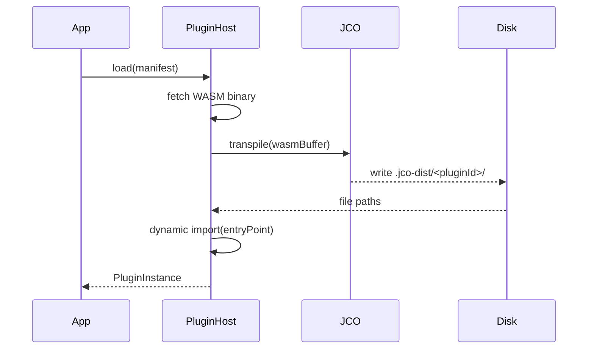
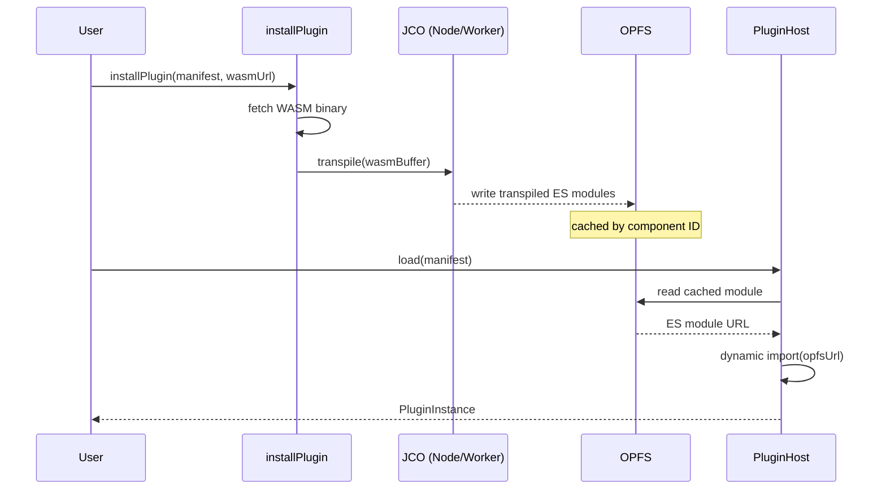

# WASM & JCO Architecture in Refarm

This document explains the technical rationale, architectural decisions, and operational details of Refarm's WebAssembly integration via the Component Model and `jco`.

## Why JCO & The Component Model?

Refarm aims for **Digital Sovereignty**. This requires a plugin system that is:
1. **Isomorphic**: Runs in Node.js, Browsers, and Edge.
2. **Capability-Gated**: Plugins should not have direct access to the host's system (I/O, Network) unless explicitly granted.
3. **Language Agnostic**: Developers should write plugins in Rust, Go, Zig, or C and have them work seamlessly.

The **Wasm Component Model** (via WIT - WebAssembly Interface Types) provides the boundary. [JCO](https://github.com/bytecodealliance/jco) is the toolset that transpiles these standardized WASM components into executable JavaScript modules.

## Transpilation Flow

The transpilation strategy depends on the runtime environment.

### Node.js (current)

### Browser (install-time, ADR-044)

## Runtime vs Build-time: onde cada coisa acontece

| Ambiente | Ferramenta | Quando é invocada | Produz |
|---|---|---|---|
| **Node.js** (dev/server) | `jco.transpile()` at runtime | `PluginHost.load()` | `.jco-dist/<pluginId>/` on disk |
| **Browser** (install) | `installPlugin()` + JCO | First use of a plugin | OPFS-cached ES modules |
| **Browser** (runtime) | `dynamic import()` | `PluginHost.load()` from OPFS | Plugin instance in memory |
| **CI** (with Rust toolchain) | `reusable-build-wasm-plugin.yml` | Rust source changes | Refreshed `pkg/` artifacts |

## WASI Stubs & Versioning

Different versions of compilers (like `cargo-component`) and tools target different "snapshots" of WASI (e.g., Preview 2). This lead to "property drift" where a component might expect `wasi:cli/environment@0.2.0` while another expects just `wasi:cli/environment`.

Refarm solves this by providing **Version-Agnostic stubs**:
- We inject imports for both unversioned and versioned keys (`@0.2.0`, `@0.2.3`).
- We provide stub classes (like `Descriptor` or `InputStream`) that JCO can "monkey-patch" during instantiation, which is a common pattern in JCO's generated glue code.

## CI/CD Alignment

To ensure high-fidelity verification without bloating CI runners:

- **Fixtures**: Stable components (like Heartwood) are pre-transpiled into `__fixtures__` within tests. This bypasses the need for full Rust toolchains during every CI run for package-level tests.
- **WASM Tracking**: Specific test fixtures are explicitly allowed in git via `.gitignore` exceptions.
- **`pkg/` as stable reference**: `packages/heartwood/pkg/` contains the JCO-transpiled artifacts committed to the repository. They are the source of truth for all consumers in standard CI runs.
— `pkg/` is used as-is. If the binary is present, it re-runs `jco transpile` to refresh `pkg/`.
- **Reusable rebuild workflow**: When Heartwood's Rust source changes and a full rebuild is required, use `.github/workflows/reusable-build-wasm-plugin.yml`. This workflow installs the Rust toolchain, compiles, transpiles, and uploads `pkg/` as an artifact. External plugin authors can call this workflow from their own repos via `uses: refarm-dev/refarm/.github/workflows/reusable-build-wasm-plugin.yml@main`.

### Toolchain Provisioning in CI

To support full compilation without requiring all workflows to duplicate Rust setup logic, Refarm uses a parameterized Setup action:

- **Centralized `./.github/actions/setup`:** Accepts a `rust-target` parameter (default: `wasm32-wasip1`). It automatically runs `rustup target add` if a target is specified. This ensures that any standard job running `npm run build` or `npm run lint` natively possesses the required WASM target to compile components like `@refarm.dev/heartwood`.

---

> "We treat WASM as the soil, JCO as the plow, and WIT as the fence that keeps the farm secure."
