# Development Workflow: SDD → BDD → TDD → DDD

**Purpose**: Prevent implementation chaos through disciplined, spec-driven quality gates.  
**Philosophy**: Specifications first, tests second, implementation last.  
**Result**: Measurable progress, guaranteed quality, maintainable codebase.

---

## Visual Overview

```
┌─────────────────────────────────────────────────────────────┐
│                    Development Lifecycle                     │
└─────────────────────────────────────────────────────────────┘

    ┌─────────┐        ┌─────────┐        ┌─────────┐        ┌─────────┐
    │   SDD   │──────▶│   BDD   │───────▶│   TDD   │──────▶│   DDD   │
    │  Specs  │        │ Int.Test│        │Unit Test│        │  Code   │
    └─────────┘        └─────────┘        └─────────┘        └─────────┘
        │                   │                   │                   │
        │                   │                   │                   │
    ADRs + Specs       Tests FAIL 🔴       Tests FAIL 🔴      Tests PASS 🟢
    peer reviewed      peer reviewed      coverage ≥80%      changeset created
        │                   │                   │                   │
        ▼                   ▼                   ▼                   ▼
    ✅ Gate 1            ✅ Gate 2           ✅ Gate 3           ✅ Gate 4
    No TODOs            Integration         Unit contracts      All GREEN
    Complete specs      behavior defined    defined             Coverage met
```

**Key Principle**: Tests fail FIRST (red), then code makes them pass (green).

**Detailed Flow**:



**Diagram Source of Truth**: [`docs/workflow-diagram.mermaid`](./workflow-diagram.mermaid)

To regenerate this diagram after editing the source:

```bash
npm run diagrams:fix
```

This will regenerate all `.svg` files from their corresponding `.mermaid` sources. See [CONTRIBUTING.md#diagrams](../CONTRIBUTING.md#diagrams) for details.

---

## Why This Workflow?

### The Problem

Software projects tend toward **implementation chaos**:

- Features built without clear requirements
- Tests written as afterthoughts (or not at all)
- Technical debt accumulates silently
- Regressions sneak in unnoticed
- Architecture drifts from original intent

### The Solution

Force structured gates at every milestone:

1. **SDD** — Define what we're building (specifications + decisions)
2. **BDD** — Define expected behavior (integration tests that FAIL)
3. **TDD** — Define contracts (unit tests that FAIL)
4. **DDD** — Implement until tests PASS

**Gate**: Cannot proceed to next phase until previous phase is complete and peer-reviewed.

---

## The Four Phases

### Phase 1: SDD (Specification Driven Development)

**Goal**: Document architectural decisions and component contracts BEFORE writing tests or code.

**Artifacts**:

- **ADRs** (Architecture Decision Records) — Major technical choices
- **Specs** — Component interfaces, data schemas, API contracts
- **Diagrams** — Data flow, sequence diagrams, architecture overviews

**Deliverables**:

```
specs/
├── ADRs/
│   └── ADR-001-monorepo-structure.md
├── features/
│   └── storage-interface.md
└── diagrams/
    └── data-flow.mermaid
```

**Quality Gate**:

- [ ] All architectural questions answered
- [ ] Public interfaces documented
- [ ] Data schemas defined (JSON-LD, WIT, TypeScript types)
- [ ] At least 1 peer review on each ADR/spec
- [ ] No "TODO" or "TBD" in critical sections

**When to Skip**: Never. Every milestone starts with SDD.

---

### Phase 2: BDD (Behavior Driven Development)

**Goal**: Write integration tests that describe **what the system should do** from a user's perspective.

**Characteristic**: Tests MUST FAIL initially (red phase).

**Artifacts**:

- Integration test suites (e2e, component integration)
- Acceptance criteria as executable tests
- User scenario tests

**Example**:

```typescript
// tests/integration/storage.spec.ts

describe("Offline-first storage", () => {
  it("persists data when offline", async () => {
    const storage = await createStorage({ offline: true });
    
    await storage.set("key", { value: "data" });
    
    // Simulate app restart
    await storage.close();
    const newStorage = await createStorage({ offline: true });
    
    const result = await newStorage.get("key");
    expect(result).toEqual({ value: "data" });
  });
  
  it("syncs data between 2 clients", async () => {
    const client1 = await createClient();
    const client2 = await createClient();
    
    await client1.set("key", "value1");
    await waitForSync();
    
    const result = await client2.get("key");
    expect(result).toBe("value1");
  });
});
```

**Quality Gate**:

- [ ] All user-facing behaviors have tests
- [ ] Tests are readable (describe user scenarios, not implementation)
- [ ] Tests FAIL (red) because implementation doesn't exist yet
- [ ] Coverage target defined (e.g., "all happy paths + 3 error cases")
- [ ] Peer reviewed for completeness

**When to Skip**:

- Small utility functions (use TDD only)
- Internal refactors that don't change behavior
- Documentation-only changes

---

### Phase 3: TDD (Test Driven Development)

**Goal**: Write unit tests that define **contracts** for individual functions/classes.

**Characteristic**: Tests MUST FAIL initially (red phase).

**Artifacts**:

- Unit test suites
- Contract tests (interfaces, types)
- Edge case coverage

**Example**:

```typescript
// packages/storage-sqlite/src/crud.test.ts

describe("CRUD operations", () => {
  let db: Database;
  
  beforeEach(() => {
    db = createInMemoryDB();
  });
  
  describe("insert", () => {
    it("returns inserted ID", async () => {
      const id = await db.insert("users", { name: "Alice" });
      expect(id).toBeGreaterThan(0);
    });
    
    it("throws on duplicate primary key", async () => {
      await db.insert("users", { id: 1, name: "Alice" });
      await expect(
        db.insert("users", { id: 1, name: "Bob" })
      ).rejects.toThrow("UNIQUE constraint failed");
    });
  });
  
  describe("CRDT merge", () => {
    it("resolves conflicts with LWW", () => {
      const state1 = { value: "A", timestamp: 100 };
      const state2 = { value: "B", timestamp: 200 };
      
      const result = merge(state1, state2);
      
      expect(result.value).toBe("B"); // Last-Write-Wins
      expect(result.timestamp).toBe(200);
    });
  });
});
```

**Quality Gate**:

- [ ] All public functions have unit tests
- [ ] Edge cases covered (null, empty, boundary conditions)
- [ ] Tests FAIL (red) because implementation is stub/missing
- [ ] Coverage ≥80% for core logic
- [ ] Fast execution (<1s for entire unit suite)

**When to Skip**:

- Pure integration components (web servers, routers)
- Thin wrappers around third-party libraries
- UI components (use BDD with component tests instead)

---

### Phase 4: DDD (Domain Driven Implementation)

**Goal**: Write the minimal code necessary to make ALL tests pass (green phase).

**Characteristic**: Tests transition from RED → GREEN.

**Artifacts**:

- Production code
- Domain models, services, repositories
- Infrastructure adapters

**Implementation Rules**:

1. **Start with simplest failing test**
2. **Write minimal code to make it pass**
3. **Refactor only when green**
4. **Repeat until all tests pass**

**Domain Organization**:

```
packages/storage-sqlite/
├── src/
│   ├── domain/           # Core business logic
│   │   ├── storage.ts    # Storage interface (spec)
│   │   └── crud.ts       # CRUD operations
│   ├── infra/            # Infrastructure adapters
│   │   ├── sqlite-adapter.ts
│   │   └── opfs-adapter.ts
│   └── index.ts          # Public API
└── tests/
    ├── unit/
    └── integration/
```

**Quality Gate**:

- [ ] All BDD tests pass (green)
- [ ] All TDD tests pass (green)
- [ ] No skipped/pending tests
- [ ] Code coverage meets target (≥80%)
- [ ] No linting errors
- [ ] Peer reviewed (code + architecture alignment with specs)
- [ ] Changeset created (`npm run changeset`)

**When to Skip**: Never. DDD is the final step where code is written.

---

## Quality Gates Summary

| Phase | Entry Criteria | Exit Criteria | Can Skip? |
|-------|----------------|---------------|-----------|
| **SDD** | Milestone defined | ADRs + specs complete, peer reviewed | ❌ Never |
| **BDD** | SDD complete | Integration tests written (RED), peer reviewed | ⚠️ Small utilities only |
| **TDD** | BDD complete | Unit tests written (RED), peer reviewed | ⚠️ Pure integration components |
| **DDD** | TDD complete | All tests GREEN, coverage met, changeset created | ❌ Never |

---

## Example: Full Cycle for `storage-sqlite`

### 1. SDD Phase

**Deliverable**: `specs/features/storage-interface.md`

```markdown
# Storage Interface Specification

## Purpose
Provide offline-first persistence via SQLite/OPFS.

## Public API
```typescript
interface Storage {
  get(key: string): Promise<unknown>;
  set(key: string, value: unknown): Promise<void>;
  delete(key: string): Promise<void>;
  close(): Promise<void>;
}
```

## Architecture Decision

- ADR-002: Use SQLite WASM + OPFS for browser persistence
- ADR-003: Virtual file system via sql.js VFS

```

**Gate**: ✅ Peer reviewed, no open questions.

---

### 2. BDD Phase

**Deliverable**: `packages/storage-sqlite/tests/integration/storage.spec.ts`

```typescript
describe("Storage", () => {
  it("persists data across restarts", async () => {
    const storage = await createStorage();
    await storage.set("key", "value");
    await storage.close();
    
    const newStorage = await createStorage();
    expect(await newStorage.get("key")).toBe("value");
  });
});
```

**Status**: 🔴 FAILING (storage not implemented yet)

**Gate**: ✅ Test is clear, peer reviewed.

---

### 3. TDD Phase

**Deliverable**: `packages/storage-sqlite/src/crud.test.ts`

```typescript
describe("CRUD", () => {
  it("insert returns ID", async () => {
    const id = await db.insert("table", { data: "value" });
    expect(id).toBeGreaterThan(0);
  });
});
```

**Status**: 🔴 FAILING (db.insert is a stub)

**Gate**: ✅ Contract tests complete, peer reviewed.

---

### 4. DDD Phase

**Deliverable**: `packages/storage-sqlite/src/crud.ts`

```typescript
export async function insert(
  db: Database,
  table: string,
  data: Record<string, unknown>
): Promise<number> {
  const keys = Object.keys(data);
  const values = Object.values(data);
  const placeholders = keys.map(() => "?").join(",");
  
  const sql = `INSERT INTO ${table} (${keys.join(",")}) VALUES (${placeholders})`;
  const result = await db.run(sql, values);
  
  return result.lastInsertRowid;
}
```

**Status**: 🟢 PASSING (all tests green)

**Gate**: ✅ Tests pass, coverage 85%, changeset created.

---

## Workflow in Practice

### Starting a New Milestone

```bash
# 1. Create ADR
vim specs/ADRs/ADR-004-identity-provider.md

# 2. Write specs
vim specs/features/identity-interface.md

# 3. Peer review (GitHub PR)
gh pr create --title "SDD: Identity Provider Spec" --label "phase:sdd"

# 4. After approval, write integration tests (BDD)
vim packages/identity-nostr/tests/integration/identity.spec.ts

# 5. Run tests (should FAIL)
npm test  # Expected: RED

# 6. Write unit tests (TDD)
vim packages/identity-nostr/src/keypair.test.ts

# 7. Run tests (should FAIL)
npm test  # Expected: RED

# 8. Implement (DDD)
vim packages/identity-nostr/src/keypair.ts

# 9. Run tests (should PASS)
npm test  # Expected: GREEN

# 10. Create changeset
npm run changeset

# 11. Open PR
gh pr create --title "feat(identity): Nostr keypair implementation" --label "phase:ddd"
```

---

## Enforcing Gates in CI/CD

### GitHub Actions Workflow

```yaml
name: Quality Gates

on: [pull_request]

jobs:
  sdd-gate:
    if: contains(github.event.pull_request.labels.*.name, 'phase:sdd')
    steps:
      - name: Check ADRs exist
        run: |
          test -f specs/ADRs/ADR-*.md || exit 1
      
      - name: Check TODOs in specs
        run: |
          ! grep -r "TODO\|TBD" specs/ || exit 1
  
  bdd-gate:
    if: contains(github.event.pull_request.labels.*.name, 'phase:bdd')
    steps:
      - name: Run integration tests
        run: npm run test:integration
      
      - name: Ensure tests fail (red phase)
        run: |
          npm run test:integration && exit 1 || exit 0
  
  tdd-gate:
    if: contains(github.event.pull_request.labels.*.name, 'phase:tdd')
    steps:
      - name: Run unit tests
        run: npm test
      
      - name: Check coverage ≥80%
        run: npm run test:coverage -- --min-coverage=80
  
  ddd-gate:
    if: contains(github.event.pull_request.labels.*.name, 'phase:ddd')
    steps:
      - name: Run all tests
        run: npm test
      
      - name: Ensure tests pass (green phase)
        run: npm test
      
      - name: Check changeset exists
        run: |
          test -n "$(ls .changeset/*.md 2>/dev/null | grep -v README)" || exit 1
      
      - name: Lint
        run: npm run lint
      
      - name: Build
        run: npm run build
```

---

## Anti-Patterns to Avoid

### ❌ Writing code before specs

```typescript
// ❌ BAD: Started implementing without spec
class Storage {
  // ... 300 lines of code ...
  // Wait, what was the interface supposed to be?
}
```

### ❌ Tests after implementation

```typescript
// ❌ BAD: Tests written to match existing code (not behavior)
it("returns undefined when key not found", () => {
  // This is testing implementation detail, not requirement
  expect(storage.get("missing")).toBe(undefined);
});
```

### ❌ Skipping tests for "simple" code

```typescript
// ❌ BAD: "This function is too simple to test"
function merge(a, b) {
  return { ...a, ...b };  // Actually has subtle bugs with nested objects
}
```

### ❌ Merging failing tests

```typescript
// ❌ BAD: "I'll fix the tests later"
describe.skip("Sync tests", () => {
  // Tests that don't pass yet
});
```

---

## When to Revisit SDD

SDD isn't "set and forget." Return to SDD when:

- **Architecture assumptions are wrong** (PoC reveals blocker)
- **Requirements change** (new user needs discovered)
- **Technology choice fails** (performance, compatibility issues)
- **Scope expands** (new features need new decisions)

**Process**: Create amendment ADR, update specs, propagate changes to BDD/TDD.

Example:

```
specs/ADRs/
├── ADR-002-storage-strategy.md         # Original
└── ADR-002-storage-strategy-AMENDED.md  # Revised after PoC
```

---

## Summary

| Phase | Purpose | Deliverable | Test Status |
|-------|---------|-------------|-------------|
| **SDD** | What to build | ADRs + Specs | N/A |
| **BDD** | Expected behavior | Integration tests | 🔴 RED |
| **TDD** | Component contracts | Unit tests | 🔴 RED |
| **DDD** | Implementation | Production code | 🟢 GREEN |

**Key Insight**: Tests fail FIRST (red), then code makes them pass (green). This prevents:

- Implementing wrong features
- Skipping edge cases
- Accumulating technical debt
- Regressions going unnoticed

**Result**: Predictable, measurable progress toward high-quality software.

---

**See Also**:

- [roadmaps/MAIN.md](../roadmaps/MAIN.md) — How this workflow applies to releases
- [CONTRIBUTING.md](../CONTRIBUTING.md) — Developer workflow
- [specs/ADRs/](../specs/ADRs/) — Architecture decisions

**Last Updated**: March 2026
