# Refarm Layer Guide

> Focused sub-views of the full architecture. Each section is an independent diagram
> you can share or embed without the cognitive load of the full picture.
>
> **Full diagram**: [`layer-diagram.svg`](./layer-diagram.svg) —
> **Index**: [`INDEX.md`](../../specs/diagrams/INDEX.md)

---

## Complete View

<!-- {=layer-full} -->
**Source**: [`layer-diagram.mermaid`](./layer-diagram.mermaid)


<!-- {/layer-full} -->

---

## Layer 1 — Distros (apps/)

The entry points. Each distro is an opinionated assembly of sovereign blocks.

<!-- {=layer-distros} -->
**Source**: [`layer-diagram--distros.mermaid`](./layer-diagram--distros.mermaid)



> The 3 distros and how each connects to the dual-runtime Tractor core.
> `apps/dev` + `apps/me` use **tractor-ts** (browser/Node via JCO).
> `apps/refarm` calls **Farmhand** over HTTP port 42001.
<!-- {/layer-distros} -->

| Distro | Runtime | Purpose |
|---|---|---|
| `apps/dev` | Astro / Browser | Developer portal (refarm.dev) |
| `apps/me` | Astro / Browser | Homestead · sovereign identity (refarm.me) |
| `apps/farmhand` | Node.js daemon | Task execution · LLM routing |
| `apps/refarm` | CLI entry | Runtime bootstrap · `refarm` command |

---

## Layer 2 — Dual-Runtime Core + WIT + Plugins

The execution engine. Same WIT contract runs on both runtimes.

<!-- {=layer-runtime} -->
**Source**: [`layer-diagram--runtime.mermaid`](./layer-diagram--runtime.mermaid)



> The execution engine: dual-runtime Tractor (TS + Rust), the WIT contract interface,
> and the plugin sandbox where `.wasm` components run.
> Both runtimes share the **same WIT** (`refarm:plugin@0.1.0`) — no divergence possible.
<!-- {/layer-runtime} -->

| Runtime | Host | Use case |
|---|---|---|
| `tractor-ts` | JCO transpile | Browser, Node.js, CI |
| `tractor` (Rust) | wasmtime | IoT, Raspberry Pi, ~27MB footprint |

WIT exports: `setup · ingest · push · respond · on-event`
WIT imports (for pi-agent): `llm-bridge · agent-fs · agent-shell`

---

## Layer 3 — Data Layer (Contracts → Adapters)

Persistence, CRDT sync, and identity — all behind capability contracts.

<!-- {=layer-data} -->
**Source**: [`layer-diagram--data.mermaid`](./layer-diagram--data.mermaid)



> Capability contracts that Tractor uses for persistence, CRDT sync, and identity.
> Each contract has pluggable adapters — **storage-sqlite** (OPFS + Loro CRDT state),
> **sync-loro** (ADR-045 Loro engine), **identity-nostr** (Nostr keypair + relay).
<!-- {/layer-data} -->

| Contract | Default adapter | Notes |
|---|---|---|
| `storage-contract-v1` | `storage-sqlite` | OPFS · SQLite · Loro CRDT state co-located |
| `sync-contract-v1` | `sync-loro` | Binary deltas · state vectors · ADR-045 |
| `identity-contract-v1` | `identity-nostr` | Ed25519 · Nostr relays |

---

## Layer 4 — Task Dispatch & Streaming

How Farmhand routes tasks and broadcasts CRDT deltas.

<!-- {=layer-streams} -->
**Source**: [`layer-diagram--streams.mermaid`](./layer-diagram--streams.mermaid)



> Task dispatch and CRDT streaming from Farmhand.
> **effort-contract-v1** routes tasks via FileTransport (NDJSON) or HttpTransport.
> **stream-contract-v1** broadcasts CRDT deltas via File, SSE, or WebSocket transport.
<!-- {/layer-streams} -->

| Contract | Adapters | Use case |
|---|---|---|
| `effort-contract-v1` | `FileTransport` · `HttpTransport (42001)` | Task queue · CLI ↔ daemon |
| `stream-contract-v1` | `FileStream` · `SseStream` · `WsStream` | CRDT delta broadcast · real-time sync |

---

## Regeneration

All sub-diagram SVGs are generated from their `.mermaid` sources:

```bash
# from project root
npm run diagrams:check
```

Sub-diagram blocks in this file are managed by [mdt](https://github.com/ifiokjr/mdt):

```bash
# from docs/diagrams/
mdt update   # sync template blocks → this file
mdt check    # verify no drift (runs in CI)
```
