# Workflow Guide — SDD → BDD → TDD → DDD

> Focused sub-views of the sovereign development methodology, one phase per section.
> Each diagram is self-contained — share or embed any phase independently.
>
> **Full diagram**: [`workflow-diagram.svg`](./workflow-diagram.svg) —
> **Index**: [`INDEX.md`](../../specs/diagrams/INDEX.md)

---

## Complete View

<!-- {=workflow-full} -->
**Source**: [`workflow-diagram.mermaid`](./workflow-diagram.mermaid)


<!-- {/workflow-full} -->

---

## Phase 1 — SDD (Specification Driven Development)

Write the spec completely before writing any test or code.

<!-- {=workflow-sdd} -->
**Source**: [`workflow-diagram--sdd.mermaid`](./workflow-diagram--sdd.mermaid)



> **Specification Driven Development**: Write ADRs, feature specs, and diagrams before any code.
> Gate 1 enforces no TODOs or TBDs — the spec must be complete and reviewed before moving on.
<!-- {/workflow-sdd} -->

| Artifact | Location | Required |
|---|---|---|
| ADRs | `specs/ADRs/` | Yes — every architectural decision |
| Feature specs | `specs/features/` | Yes — acceptance criteria and data model |
| Diagrams | `specs/diagrams/` or `docs/diagrams/` | Yes — at least one flow diagram |
| PR label | `phase:sdd` | Yes — triggers CI SDD gate |

---

## Phase 2 — BDD (Behavior Driven Development)

Capture behavior as failing integration tests before implementation.

<!-- {=workflow-bdd} -->
**Source**: [`workflow-diagram--bdd.mermaid`](./workflow-diagram--bdd.mermaid)



> **Behavior Driven Development**: Write integration tests that capture acceptance criteria.
> Tests must be **RED** at Gate 2 — a passing test here means the behavior wasn't captured yet.
<!-- {/workflow-bdd} -->

| Artifact | Location | Required |
|---|---|---|
| Integration tests | `**/tests/integration/` | Yes — must FAIL at gate |
| Acceptance criteria | In test descriptions | Yes — readable, spec-linked |
| PR label | `phase:bdd` | Yes — triggers CI BDD gate |

---

## Phase 3 — TDD (Test Driven Development)

Define unit contracts and coverage targets before writing implementation.

<!-- {=workflow-tdd} -->
**Source**: [`workflow-diagram--tdd.mermaid`](./workflow-diagram--tdd.mermaid)



> **Test Driven Development**: Write unit tests and define contracts — all must be RED.
> Gate 3 requires tests failing **and** ≥80% coverage target documented before implementation begins.
<!-- {/workflow-tdd} -->

| Artifact | Location | Required |
|---|---|---|
| Unit tests | `**/tests/unit/` or `*.test.ts` | Yes — must FAIL at gate |
| Contract types | `packages/*-contract-*/` | Yes — typed interfaces |
| Coverage target | Noted in spec or PR description | Yes — ≥80% |
| PR label | `phase:tdd` | Yes — triggers CI TDD gate |

---

## Phase 4 — DDD (Domain Driven Development)

Implement domain logic until all tests turn green.

<!-- {=workflow-ddd} -->
**Source**: [`workflow-diagram--ddd.mermaid`](./workflow-diagram--ddd.mermaid)



> **Domain Driven Development**: Implement domain logic until all tests turn GREEN.
> Gate 4 requires all tests green, coverage met, a changeset entry, and peer review.
<!-- {/workflow-ddd} -->

| Artifact | Location | Required |
|---|---|---|
| Domain implementation | `packages/` or `apps/` | Yes — all tests must pass |
| Infrastructure adapters | `packages/*-sqlite/`, `packages/*-loro/` etc. | If applicable |
| Changeset | `.changeset/*.md` | Yes — semver bump entry |
| PR label | `phase:ddd` | Yes — triggers CI DDD gate |

See [CI_GUIDE.md](../../specs/diagrams/CI_GUIDE.md) for the CI enforcement of each gate.

---

## Regeneration

```bash
# from project root
npm run diagrams:fix

# from docs/diagrams/
mdt update   # sync template blocks → this file
mdt check    # verify no drift (runs in CI)
```
