# Distro Evolution Model — Bootstrap → Sovereign

> **Why this document exists**: The pattern "repo seed → sovereign graph" is architecturally
> and philosophically central to Refarm. Without a canonical reference, each distro risks
> being built on a different mental model of how this transition works. This document
> establishes the shared model.

**Applies to**: `apps/me` (refarm.me), `apps/dev` (refarm.dev), and any future distro.
**Related ADRs**: [ADR-046 — Composition Model](../specs/ADRs/ADR-046-refarm-composition-model.md) (Blocks vs Distros), [ADR-044 — WASM Plugin Loading](../specs/ADRs/ADR-044-wasm-plugin-loading-browser-strategy.md) (OPFS install-time), [ADR-021 — Self-Healing & Plugin Citizenship](../specs/ADRs/ADR-021-self-healing-and-plugin-citizenship.md) (plugin lifecycle), [ADR-020 — Sovereign Graph Versioning](../specs/ADRs/ADR-020-sovereign-graph-versioning.md) (graph commit model)

---

## The Model in Two Phases



### Phase 1 — Bootstrap (repo seed)

The distro is a static SSG/PWA served from the repository. Everything is baked in.

**What the repo provides:**
- The `StudioShell` layout (slot structure, routing)
- Shell plugins baked-in as npm dependencies (`HeraldPlugin`, `FireflyPlugin`)
- Initial app configuration (`astro.config.mjs`, env vars)
- A minimal OPFS seed (empty on first boot)

**Plugin loading in bootstrap:**
- System/shell plugins: always npm dependencies — never discovered dynamically
- Content plugins: can be loaded via `installPlugin()` with an explicit URL + SHA-256
- No discovery: there is no registry to query, no graph to consult

**Tractor's role in bootstrap:**
- Syncs the sovereign graph from disk → OPFS on connect
- Executes plugins via WASI on behalf of the browser
- Does not impose configuration on the distro

**State of the graph at bootstrap:**
- Empty OPFS on first boot
- After first tractor sync: graph contains whatever the user has accumulated
- Until a `refarm:PluginRegistry` node exists in the graph: Phase 1 continues

---

### Phase 2 — Sovereign Mode (graph-driven)

The graph has been populated. The distro can now read the user's sovereign configuration.

**What changes:**
- The distro queries the graph: "Does a `refarm:PluginRegistry` node exist?"
- If yes: discover plugins listed in the registry → install them dynamically
- Plugin catalog is no longer hardcoded in the repo — it lives in the user's graph
- Distro configuration (slot order, theme, active plugins) can be read from graph nodes

**What does NOT change:**
- Shell plugins (`HeraldPlugin`, `FireflyPlugin`) remain npm dependencies — always static
- The shell layout is still served from the repo — the graph cannot alter DOM structure
- `installPlugin()` still validates SHA-256 — the graph never bypasses integrity checks

**Tractor's role in sovereign mode:**
- Same as bootstrap — syncs, executes, persists
- Tractor does not know whether the graph has a `PluginRegistry`; the distro decides

---

## The Point of Inflexion

The transition from Phase 1 → Phase 2 is **not a migration event**. It is a merge:

```
distro state = repo seed + graph (graph takes precedence for plugins and config)
```

**The inflexion occurs when:**
> The local OPFS graph confirms at least one node of type `refarm:PluginRegistry`

Before that node exists: the distro operates exclusively from the repo seed.
After: the distro merges repo seed (shell, layout) with graph (plugin catalog, config).

This is checked at boot time and on every tractor sync. No manual trigger is needed.

---

## Criteria by Phase

| Dimension | Bootstrap (v0.1.0) | Sovereign (v0.2.0+) |
|-----------|-------------------|---------------------|
| Shell plugins (Herald, Firefly) | npm dependencies | Same — always static |
| Content plugins | Explicit URL + SHA-256 (hardcoded) | Discovered via `refarm:PluginRegistry` |
| Distro configuration | `astro.config.mjs` + env vars | Nodes in the sovereign graph |
| Identity | Unauthenticated or session token | Nostr key via `identity-nostr` (v0.2.0+) |
| OPFS contents | Empty seed (first boot) or last sync | Full user graph |
| Plugin discovery | None | `refarm:PluginRegistry` nodes in graph |

---

## Architectural Note: Who Is Responsible

Each layer stays within its boundary:

- **A block** (`sync-loro`, `storage-sqlite`) is distro-neutral. It knows nothing about
  `refarm:PluginRegistry` or shell slots. It provides primitives.

- **A shell plugin** (`HeraldPlugin`, `FireflyPlugin`, via `packages/homestead/sdk/`)
  knows about its own slot. It does not know what distro it is running in.

- **The distro** (`apps/me`, `apps/dev`) is the only layer that:
  - Knows what `refarm:PluginRegistry` means
  - Decides when the inflexion has occurred
  - Merges repo seed with graph configuration
  - Routes the user experience

- **Tractor** syncs and executes. It does not interpret graph semantics; that is the
  distro's responsibility.

> The bootstrap → sovereign inflexion is a **distro-level concern**, not a tractor or
> block concern.

---

## What This Model Is Not

- **Not a runtime switch**: the distro does not "switch modes". It checks the graph on
  every boot and merges what is available.
- **Not a forced migration**: a user who never populates their `PluginRegistry` stays in
  bootstrap mode indefinitely — this is valid.
- **Not opaque to the user**: the distro can surface "you are in bootstrap mode" vs
  "your sovereign graph is active" as a first-class UX concept.
