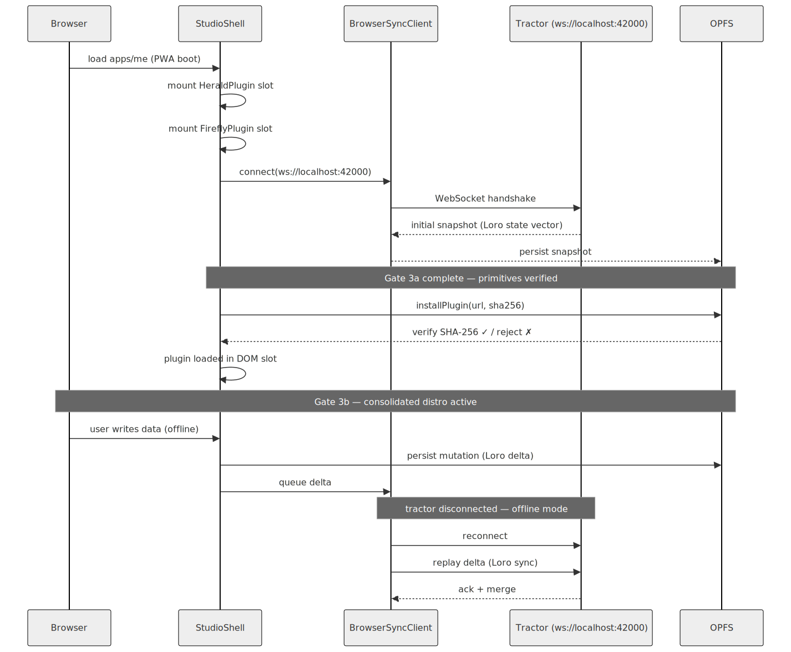

# Gate 3 — Homestead × Tractor Integration Spec

> **Why this gate matters**: Gate 3 is the last technical prerequisite before the org
> migration (Gate 1) pays off. Homestead + tractor working end-to-end is "v0.1.0 for
> real" — a browser app pairing with a native Rust daemon over Loro CRDTs. But passing
> the primitives alone is not enough: the gate is complete only when `apps/me` boots as
> a consolidated distro, exactly as it will behave in production.

**Status**: 🚧 Pending
**Tracked by**: [`docs/v0.1.0-release-gate.md`](v0.1.0-release-gate.md)
**Related ADRs**: [ADR-044](../specs/ADRs/ADR-044-wasm-plugin-loading-browser-strategy.md), [ADR-048](../specs/ADRs/ADR-048-tractor-graduation.md)

---

## What "Pairing" Means

`Homestead` (browser app) talks to `tractor` (Rust binary) via:

```
BrowserSyncClient (TS)  ──WebSocket──►  ws://localhost:42000  (tractor)
                        ◄──Loro binary update──
```

Both sides share the same SQLite schema (`PHYSICAL_SCHEMA_V1`), verified by
`schema_compat_ts_db_readable` conformance test. The binary Loro update format is
validated by `loro_binary_js_interop`.

### Sequence

1. User launches `tractor` binary (or it is running as OS daemon).
2. Homestead's `BrowserSyncClient` connects to `ws://localhost:42000`.
3. On connect, tractor sends current state as a Loro snapshot.
4. Homestead applies the snapshot to its local OPFS-backed SQLite.
5. Any mutation in Homestead produces a Loro delta → sent to tractor → persisted to disk.

---

## Integration Sequence



---

## Gate 3a: Technical Primitives (Prerequisite)

These 3 tests must pass first. They are necessary but not sufficient for Gate 3.

> **Note**: These tests passing does NOT mean Gate 3 is done. They establish that the
> individual components work. Gate 3 is complete only when `apps/me` boots as a
> consolidated distro (Gate 3b).

### Test 1: WebSocket Connection

```
tractor binary running on port 42000
BrowserSyncClient.connect("ws://localhost:42000")
→ ASSERT: connection established, no handshake error
→ ASSERT: initial snapshot received within 2s
```

### Test 2: Sync Roundtrip

```
Write a node via tractor CLI / direct DB insert
BrowserSyncClient receives Loro delta
→ ASSERT: node appears in Homestead's local store (SQLite OPFS)
→ ASSERT: node.updatedAt matches tractor's write timestamp (±1s)
```

### Test 3: Plugin Load from OPFS

```
installPlugin("urn:plugin:test-echo") with valid SHA-256
→ ASSERT: bundle fetched (or cache hit) and written to OPFS
→ ASSERT: tractor can execute the plugin (setup → ingest → teardown lifecycle)
→ ASSERT: SHA-256 mismatch → rejected, no partial write
```

---

## Gate 3b: Reference Distro — `apps/me` (the actual gate)

### Why `apps/me`

`apps/me` (refarm.me) is the sovereign citizen hub — the smallest meaningful distro:

- **Footprint**: homestead + sync-loro + tractor + storage-sqlite
- **No optional complexity**: no sower, no scarecrow, no ds
- **Represents the core case**: a person pairing their browser with their local tractor

This makes it the ideal reference distro: minimal surface area, maximum real-world
fidelity.

### What "Consolidated State" Means

Each item below is a criterion, not an aspiration. All must be true simultaneously:

1. **`StudioShell` orchestrates Herald + Firefly in real DOM slots** — no placeholder
   `<div>`s standing in for shell components
2. **`HeraldPlugin` initializes** — identity state is legible (at minimum: `"unauthenticated"`)
3. **`FireflyPlugin` initializes** — system notifications are functional
4. **`BrowserSyncClient` connected** — tractor running on `ws://localhost:42000`,
   initial snapshot received and applied to OPFS
5. **At least 1 sovereign content plugin loaded from OPFS via `installPlugin()`** — with
   SHA-256 integrity validated
6. **Offline-first confirmed** — disconnect tractor → write a mutation in the browser →
   reconnect → Loro delta delivered to tractor

### Acceptance Tests: Distro Boot (3 tests, beyond primitives)

#### Distro Test 1: Shell Boot

```
Launch apps/me in browser (tractor running)
→ ASSERT: StudioShell mounts without errors in console
→ ASSERT: HeraldPlugin slot is active (not placeholder)
→ ASSERT: FireflyPlugin slot is active (not placeholder)
→ ASSERT: identity state readable (any value, including "unauthenticated")
```

#### Distro Test 2: Plugin Lifecycle

```
installPlugin("urn:plugin:test-echo") via apps/me UI
→ ASSERT: plugin installed, SHA-256 validated
→ ASSERT: second call → cache hit (no re-fetch)
→ ASSERT: setup() called → ingest(payload) called → teardown() called
→ ASSERT: plugin teardown leaves OPFS in clean state
```

#### Distro Test 3: Offline Roundtrip

```
1. apps/me connected to tractor, snapshot applied
2. Disconnect tractor (kill process)
3. Write mutation in browser (e.g., create a node)
→ ASSERT: mutation written to OPFS
→ ASSERT: no crash, app continues operating

4. Reconnect tractor
→ ASSERT: Loro delta delivered to tractor within 5s of reconnect
→ ASSERT: tractor's DB reflects the mutation
```

---

## POC vs Consolidated (Definition)

This distinction must be explicit:

**POC (does NOT satisfy Gate 3)**:
> "The WebSocket connection opens and closes without error."

Passing Gate 3a primitives means the components exist and interoperate at the API level.
It does not prove the distro functions as a coherent product.

**Consolidated (satisfies Gate 3b)**:
> A user can open `apps/me` in the browser, it pairs with their local tractor, loads
> their plugins from OPFS, persists state offline, and delivers mutations back to tractor
> on reconnect — exactly as it will behave when published as a PWA.

The difference: POC tests pipes. Consolidated tests the user's experience of the product.

---

## `installPlugin()` + OPFS Cache Requirements (ADR-044)

| Requirement | Detail |
|-------------|--------|
| Cache key | Plugin URN + version hash |
| Validation | SHA-256 of bundle bytes must match manifest `integrity` field |
| Cache miss | Fetch from source URL, validate, write to OPFS |
| Cache hit | Verify SHA-256 of cached bytes (not just presence) |
| Failure | Throw `PluginIntegrityError`; do not load partial bundle |
| Eviction | LRU by access time; max configurable (default: 50 MB) |

---

## Schema Compatibility Checkpoint

`PHYSICAL_SCHEMA_V1` is confirmed compatible TS↔Rust by conformance test
`schema_compat_ts_db_readable` (runs in Gate 4). Before Gate 3 tests run:

- [ ] Confirm `schema_compat_ts_db_readable` still passing against current tractor binary.
- [ ] Confirm `loro_binary_js_interop` still passing (fixture path fixed 2026-03-20).

---

## Dependencies

| Dependency | Status |
|------------|--------|
| `tractor` binary (port 42000) | ✅ Graduated ADR-048 |
| `BrowserSyncClient` (TS) | ✅ In `packages/sync-loro/src/browser-sync-client.ts` |
| OPFS SQLite in Homestead | ✅ ADR-002/009 |
| `installPlugin()` skeleton | ✅ In `packages/tractor-ts/src/lib/install-plugin.ts`; SHA-256 + OPFS cache 🚧 |
| `StudioShell` (Shell.ts) | ✅ In `packages/homestead/sdk/` |
| `HeraldPlugin` (Herald.ts) | ✅ In `packages/homestead/sdk/` |
| `FireflyPlugin` (Firefly.ts) | ✅ In `packages/homestead/sdk/` |
| WIT `world refarm-identity-plugin` | ✅ commit `07f338b` |
| `apps/me` as reference distro | 🚧 Bootstrap phase in progress |
