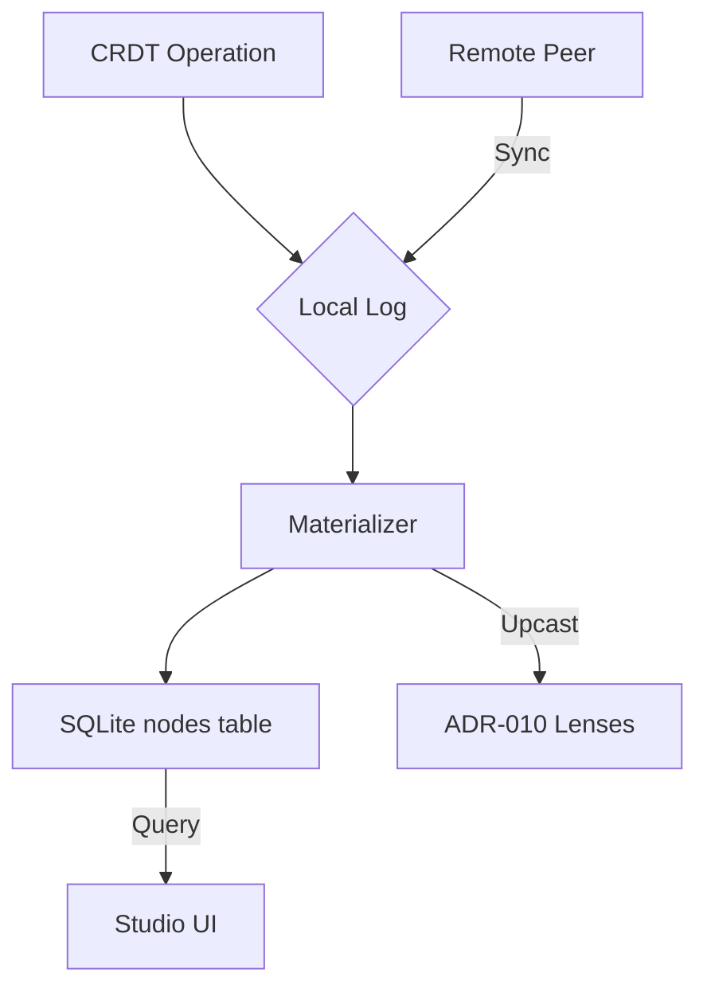

# ADR-028: CRDT-SQLite Convergence Strategy

**Status**: Proposed
**Date**: 2026-03-08
**Context**:
Refarm uses a "Sovereign Graph" (JSON-LD) persisted in SQLite. Synchronization happens via CRDTs (Conflict-free Replicated Data Types) to ensure offline-first consistency. The "mathematical nightmare" arises when:

1. Multiple peers edit the same node concurrently.
2. Peers have different versions of a plugin (different schemas).
3. The underlying SQLite schema (indices, columns) evolves.

**Decision**:
We will adopt a **Triple-based Op-Log with Lazy Materialization**.

1. **Granularity**: CRDT operations happen at the **field level (LWW-Register)** within a JSON-LD node, not the whole document.
2. **The Truth is the Log**: The `crdt_log` table is the definitive source of truth. The `nodes` table is a materialized view optimized for SQL queries.
3. **Causality**: Use **Hybrid Logical Clocks (HLC)** to provide stable, monotonically increasing timestamps across distributed peers without requiring perfect clock sync.
4. **Convergence during Schema Evolution**:
   - **Ghost Fields**: If a peer receives an update for a field not present in its current SQL schema, the operation is still stored in the `crdt_log`.
   - **Lens-Aware Sync**: When a plugin upcasts a node (via ADR-010 Lenses), it must also generate "migration operations" in the CRDT log to ensure peers eventually converge on the new schema.
   - **Conflict Resolution**: Last-Write-Wins (LWW) based on HLC timestamps.

**Proposed Architecture**:

**Consequences**:

- **Positive**:
  - Guaranteed eventual convergence (Strong Eventual Consistency).
  - Robustness against "schema drift" between peers.
  - "Time-travel" debugging possible by replaying the log.
- **Negative**:
  - Increased storage overhead (storing both log and materialized nodes).
  - Write latency (materialization overhead).

**Why not simple document-level CRDT?**
Because merging whole JSON-LD documents leads to lost updates in nested structures. Field-level LWW is the "Goldilocks" level of complexity for our microkernel.
