# Architecture Layers Guide

> Focused sub-views of the full system architecture. Each section is an independent diagram
> you can share or embed without the cognitive load of the full picture.
>
> **Full diagram**: [`architecture-layers.svg`](./architecture-layers.svg) —
> **Index**: [`INDEX.md`](./INDEX.md)

---

## Complete View

<!-- {=arch-full} -->
**Source**: [`architecture-layers.mermaid`](./architecture-layers.mermaid)


<!-- {/arch-full} -->

---

## Layer 1 — Apps → Runtime → Plugin Sandbox

How distros connect to the dual-runtime Tractor core and reach the plugin sandbox.

<!-- {=arch-apps-runtime} -->
**Source**: [`architecture-layers--apps-runtime.mermaid`](./architecture-layers--apps-runtime.mermaid)



> The execution path from distros to the plugin sandbox.
> All 4 apps route through the dual-runtime Tractor core, which exposes a single WIT contract
> (`refarm:plugin@0.1.0`) shared by both `tractor-ts` (JCO) and `tractor` (wasmtime).
> Plugins run in an isolated `.wasm` sandbox on either runtime.
<!-- {/arch-apps-runtime} -->

| Distro | Runtime | Purpose |
|---|---|---|
| `apps/dev` | Astro / Browser | Developer portal (refarm.dev) |
| `apps/me` | Astro / Browser | Homestead · sovereign identity (refarm.me) |
| `apps/farmhand` | Node.js daemon | Task execution · LLM routing |
| `apps/refarm` | CLI entry | Runtime bootstrap · `refarm` command |

WIT exports: `setup · ingest · push · respond · on-event`
WIT imports (pi-agent only): `llm-bridge · agent-fs · agent-shell`

---

## Layer 2 — Capability Contracts

Five contracts that mediate all cross-cutting concerns. Tractor and Farmhand never access infrastructure directly.

<!-- {=arch-contracts} -->
**Source**: [`architecture-layers--contracts.mermaid`](./architecture-layers--contracts.mermaid)



> The five capability contracts that mediate all cross-cutting concerns.
> Tractor cores never touch storage, sync, or identity directly — they go through contracts.
> Farmhand routes tasks via `effort-contract-v1` and broadcasts CRDT deltas via `stream-contract-v1`.
<!-- {/arch-contracts} -->

| Contract | Owner | Purpose |
|---|---|---|
| `effort-contract-v1` | Farmhand | Task dispatch and routing |
| `stream-contract-v1` | Farmhand | CRDT delta broadcasting |
| `storage-contract-v1` | Tractor | Persistence behind OPFS/SQLite |
| `sync-contract-v1` | Tractor | Binary Loro CRDT sync |
| `identity-contract-v1` | Tractor | Nostr keypair and relay access |

---

## Layer 3 — Transport & Storage Adapters

Concrete implementations wired behind each contract at runtime.

<!-- {=arch-adapters} -->
**Source**: [`architecture-layers--adapters.mermaid`](./architecture-layers--adapters.mermaid)



> Concrete adapter implementations plugged behind each contract at runtime.
> Transport adapters: `FileTransport` (NDJSON tasks), `HttpTransport` (port 42001), SSE/WS streams.
> Storage adapters: `storage-sqlite` (OPFS + Loro CRDT), `storage-memory` (tests), `identity-nostr`.
<!-- {/arch-adapters} -->

| Contract | Default adapter | Alt adapter |
|---|---|---|
| `effort-contract-v1` | `FileTransportAdapter` | `HttpTransportAdapter` |
| `stream-contract-v1` | `SseStreamTransport` | `WsStreamTransport` · `FileStreamTransport` |
| `storage-contract-v1` | `storage-sqlite` | `storage-memory` (tests) |
| `sync-contract-v1` | `sync-loro` | — |
| `identity-contract-v1` | `identity-nostr` | — |

---

## Regeneration

```bash
# from project root
npm run diagrams:fix

# from specs/diagrams/
mdt update   # sync template blocks → this file
mdt check    # verify no drift (runs in CI)
```
