# CI Pipeline Guide

> Focused sub-views of the full CI pipeline. Each section explains one stage.
>
> **Full diagram**: [`ci-pipeline.svg`](./ci-pipeline.svg) —
> **Index**: [`INDEX.md`](./INDEX.md)

---

## Complete View

<!-- {=ci-full} -->
**Source**: [`ci-pipeline.mermaid`](./ci-pipeline.mermaid)


<!-- {/ci-full} -->

---

## Stage 1 — Change Detection

Every run starts by computing exactly what changed and which jobs need to run.

<!-- {=ci-changes} -->
**Source**: [`ci-pipeline--changes.mermaid`](./ci-pipeline--changes.mermaid)



> Smart change detection: every push/PR computes a `turbo_filter` (`...[base_sha]`)
> and a set of boolean flags that gate each downstream job.
> Only affected packages are tested — unaffected packages use Turborepo cache.
<!-- {/ci-changes} -->

| Flag | Trigger paths | Downstream |
|---|---|---|
| `code_changes` | `apps/ packages/ scripts/` | quality · build · audit |
| `tractor_gates` | `tractor* barn storage-sqlite sync-loro` | tractor specialized gates |
| `run_task_smoke` | `farmhand refarm effort pi-agent` | CLI ↔ sidecar smoke |
| `run_e2e` | `apps/ validations/ tractor*` | Playwright E2E |
| `run_deep` | weekly schedule or `ci:deep` PR label | full regression |

---

## Stage 2 — Quality Job

The main enforcement gate. Runs on every code change.

<!-- {=ci-quality} -->
**Source**: [`ci-pipeline--quality.mermaid`](./ci-pipeline--quality.mermaid)



> The `quality` job is the main enforcement layer. It runs project consistency checks,
> security audit, TypeScript preflight, and task smoke tests on every code change.
> When Tractor packages are affected, an additional set of specialized gates runs:
> health probe, runtime descriptor, revocation diagnostics, benchmark, and coverage.
<!-- {/ci-quality} -->

**Tractor gates** only run when `tractor_gates=true` (Tractor, Barn, storage-sqlite, or sync-loro changed):

| Gate | Purpose |
|---|---|
| Health probe smoke | Boots `@refarm.dev/tractor-rs` and verifies health endpoint |
| Runtime-module:ci | Validates browser runtime descriptor is deterministic |
| Release-path smoke | Verifies descriptor survives the publish pipeline |
| Revocation diagnostics | Report + baseline diff + history trend |
| Benchmark gate | Compares bench vs main baseline; comments PR on new high-water mark |
| Coverage gate | Enforces coverage baseline; comments PR on new high score |

---

## Stage 3 — Phase Gates (SDD → BDD → TDD → DDD)

Label-driven gates that enforce the sovereign development methodology.

<!-- {=ci-phase-gates} -->
**Source**: [`ci-pipeline--phase-gates.mermaid`](./ci-pipeline--phase-gates.mermaid)



> Each PR carries a `phase:sdd/bdd/tdd/ddd` label that triggers the matching gate.
> Gates enforce the **SDD→BDD→TDD→DDD** methodology at the CI level:
> specs must be clean before tests go red, tests must be red before code is written,
> and a changeset must exist before a DDD PR can merge.
<!-- {/ci-phase-gates} -->

| Label | Gate | Requirement |
|---|---|---|
| `phase:sdd` | SDD gate | `specs/` changed · no TODO/TBD |
| `phase:bdd` | BDD gate | Integration tests must **FAIL** (red phase) |
| `phase:tdd` | TDD gate | Unit tests + coverage ≥80% |
| `phase:ddd` | DDD gate | All tests green + `.changeset/*.md` present |

See [WORKFLOW.md](../WORKFLOW.md) for the full SDD→BDD→TDD→DDD process narrative.

---

## Regeneration

```bash
# from project root
npm run diagrams:check

# from specs/diagrams/
mdt update   # sync template blocks → this file
mdt check    # verify no drift (runs in CI)
```
