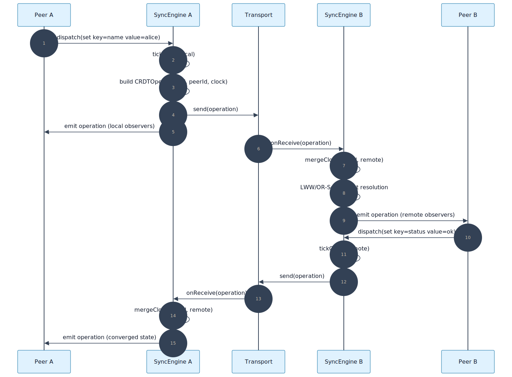
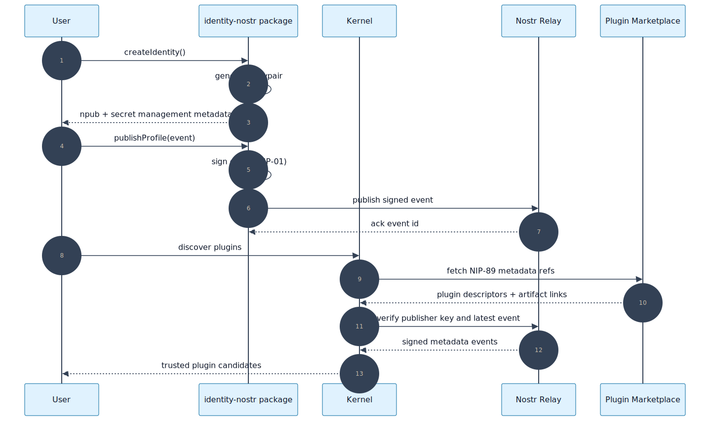

# Mermaid Diagram Catalog (MOC)

This file is the Map of Content for architecture-grade diagrams in Refarm.

## Design System Backbone

- Global style config: [mermaid.config.json](./mermaid.config.json)
- Design system guide: [DESIGN_SYSTEM.md](./DESIGN_SYSTEM.md)
- Source files: `*.mermaid`
- Rendered files: `*.svg`

## Diagram Map

### Full diagrams

| Domain | Diagram | Purpose | Focused guide |
|---|---|---|---|
| Architecture | [Architecture Layers](./architecture-layers.svg) | Boundaries between apps, packages, contracts, and infra | — |
| Runtime | [Plugin Lifecycle](./plugin-lifecycle.svg) | Install/verify/load/execute/teardown lifecycle | — |
| Data | [Data Flow](./data-flow.svg) | Ingestion to JSON-LD validation and persistence | — |
| Sync | [Sync CRDT Sequence](./sync-crdt.svg) | Peer operation flow and merge semantics | — |
| Identity | [Identity Nostr Sequence](./identity-nostr.svg) | Identity, signing, relay verification | — |
| Persistence | [Storage SQLite / OPFS](./storage-sqlite.svg) | Adapter, migrations, and browser storage runtime | — |
| Delivery | [CI Pipeline](./ci-pipeline.svg) | Quality/build/e2e/audit orchestration | [CI_GUIDE.md](./CI_GUIDE.md) |

### Sub-diagrams (focused views via mdt)

Layer diagram sub-views → **[docs/diagrams/LAYERS.md](../../docs/diagrams/LAYERS.md)**

| View | Diagram | What it shows |
|---|---|---|
| Distros | [layer-diagram--distros.svg](../../docs/diagrams/layer-diagram--distros.svg) | 4 apps and their Tractor connection |
| Runtime | [layer-diagram--runtime.svg](../../docs/diagrams/layer-diagram--runtime.svg) | Dual-runtime core + WIT + plugin sandbox |
| Data | [layer-diagram--data.svg](../../docs/diagrams/layer-diagram--data.svg) | Capability contracts → storage/sync/identity adapters |
| Streams | [layer-diagram--streams.svg](../../docs/diagrams/layer-diagram--streams.svg) | Effort + Stream contracts → transport adapters |

CI pipeline sub-views → **[CI_GUIDE.md](./CI_GUIDE.md)**

| View | Diagram | What it shows |
|---|---|---|
| Change detection | [ci-pipeline--changes.svg](./ci-pipeline--changes.svg) | Smart filtering and job flags |
| Quality gates | [ci-pipeline--quality.svg](./ci-pipeline--quality.svg) | Quality job + tractor specialized gates |
| Phase gates | [ci-pipeline--phase-gates.svg](./ci-pipeline--phase-gates.svg) | SDD/BDD/TDD/DDD label-driven gates |

## Visual Showcase

### Architecture Layers

Source: [architecture-layers.mermaid](./architecture-layers.mermaid)



### Plugin Lifecycle

Source: [plugin-lifecycle.mermaid](./plugin-lifecycle.mermaid)



### Data Flow

Source: [data-flow.mermaid](./data-flow.mermaid)



### Sync CRDT Sequence

Source: [sync-crdt.mermaid](./sync-crdt.mermaid)



### Identity Nostr Sequence

Source: [identity-nostr.mermaid](./identity-nostr.mermaid)



### Storage SQLite / OPFS

Source: [storage-sqlite.mermaid](./storage-sqlite.mermaid)



### CI Pipeline

Source: [ci-pipeline.mermaid](./ci-pipeline.mermaid)



## Diagrams Used in docs/

These 12 diagrams live in `docs/diagrams/` and are embedded directly in documentation files.
They are generated by the same pipeline (`npm run diagrams:fix`) but are co-located with
the docs that use them.

| Domain | Diagram | Used in |
|---|---|---|
| Architecture | [Layer Diagram](../../docs/diagrams/layer-diagram.svg) | `docs/ARCHITECTURE.md` |
| Sovereignty | [Sovereignty L0 — Persistence](../../docs/diagrams/sovereignty-l0.svg) | `docs/ARCHITECTURE.md` |
| Sovereignty | [Sovereignty L1 — Self-Healing](../../docs/diagrams/sovereignty-l1.svg) | `docs/ARCHITECTURE.md` |
| Sovereignty | [Sovereignty L2 — Pluggable Storage](../../docs/diagrams/sovereignty-l2.svg) | `docs/ARCHITECTURE.md` |
| Sovereignty | [Sovereignty L3 — Graph Versioning](../../docs/diagrams/sovereignty-l3.svg) | `docs/ARCHITECTURE.md` |
| Sovereignty | [Sovereignty L4 — Plugin Citizenship](../../docs/diagrams/sovereignty-l4.svg) | `docs/ARCHITECTURE.md` |
| Sovereignty | [Sovereignty L5 — Philosophy](../../docs/diagrams/sovereignty-l5.svg) | `docs/ARCHITECTURE.md` |
| UX | [User Journey](../../docs/diagrams/user-journey.svg) | `docs/USER_STORY.md` |
| Workflow | [Workflow Diagram](../../docs/diagrams/workflow-diagram.svg) | `docs/WORKFLOW.md` |
| Runtime | [Plugin Execution Context](../../docs/diagrams/plugin-execution-context.svg) | `docs/PLUGIN_DEVELOPER_PLAYBOOK.md` |
| AI / TEM | [TEM Architecture](../../docs/diagrams/tem-architecture.svg) | `packages/plugin-tem/docs/ARCHITECTURE.md` |
| AI / TEM | [TEM Codegen Pipeline](../../docs/diagrams/tem-codegen-pipeline.svg) | `packages/plugin-tem/CODEGEN.md` |
| Gate 3 | [Gate 3 Integration Sequence](../../docs/diagrams/gate3-integration-sequence.svg) | `docs/gate3-homestead-tractor-spec.md` |
| Distro | [Bootstrap → Sovereign Lifecycle](../../docs/diagrams/bootstrap-sovereign-lifecycle.svg) | `docs/distro-evolution-model.md` |

---

## Regeneration

```bash
npm run diagrams:fix
```

After editing any `*.mermaid` or `mermaid.config.json`, regenerate SVGs and commit both source and rendering.

> **Canonical script**: `npm run diagrams:fix` (uses `mermaid.config.json` — branded theme).
> `npm run diagrams:generate` is a legacy script using the neutral theme; do not use it for
> new diagrams. See [DESIGN_SYSTEM.md](./DESIGN_SYSTEM.md) for the design token spec.
